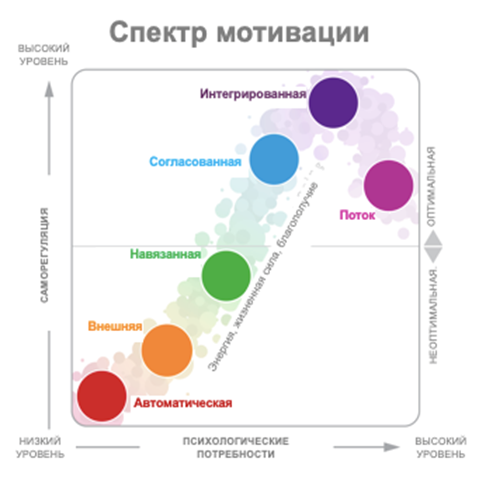

- [Почему мы все называем командами то, что командами не является / Виталий Шароватов](https://www.youtube.com/watch?v=vfAdfiSd-a0&list=WL&index=95)
- [Почему мы охотно нанимаем джунов и советуем всем делать то же самое](https://habr.com/ru/companies/agima/articles/856526/)

- [Игра за продакта](https://tsergey-tm.github.io/dev-game/)

- [Законы разработки](https://hacker-laws.com/) и [13 законов разработки ПО](https://habr.com/ru/companies/ruvds/articles/898254/) - некоторые из них

- [Может ли менеджер мотивировать своих сотрудников?](https://habr.com/ru/companies/oleg-bunin/articles/500622/)