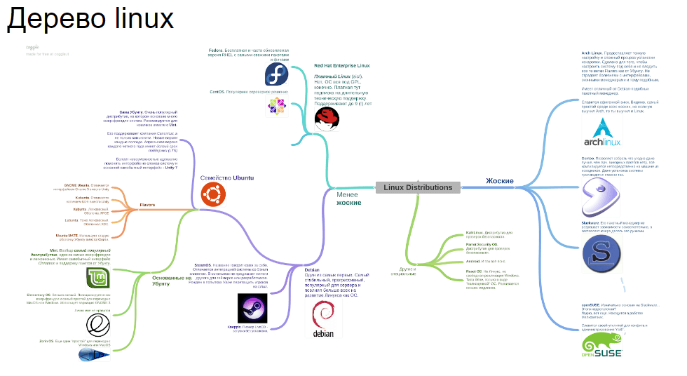
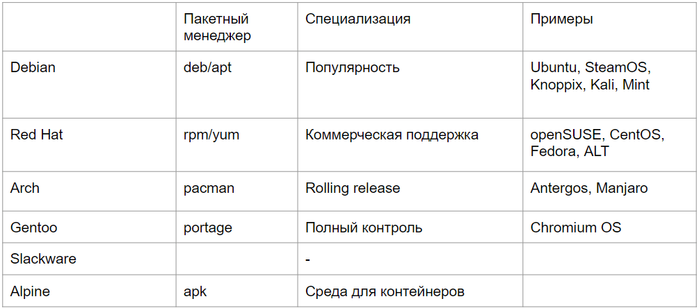

# 1 История GNU/Linux, концепции и стандарты POSIX. Основные компоненты Linux и различия в дистрибутивах

*История*
****1983 год: Ричард Столлман, работавший в MIT, объявил о создании проекта GNU (GNU's Not Unix) с целью создать свободную операционную систему, совместимую с Unix. Он основал Фонд свободного программного обеспечения (FSF) для поддержки этой инициативы

1985 год: Столлман опубликовал "Манифест GNU", в котором изложил философию свободного программного обеспечения и цели проекта GNU

1991 год: Линус Торвальдс, студент из Финляндии, начал разработку ядра операционной системы, которое он назвал Linux. Он опубликовал исходный код и пригласил других разработчиков присоединиться к проекту

1992 год: Linux был лицензирован под GNU General Public License (GPL), что позволило его свободное распространение и модификацию

1992 год: Комбинация ядра Linux и утилит и библиотек GNU создала полноценную операционную систему, известную как GNU/Linux. Это позволило пользователям иметь свободную и открытую альтернативу коммерческим Unix-подобным системам

А вот они - слоны GNU/Linux

*POSIX (Portable Operating System Interface, набор стандартов)*

- Многопользовательность
- Многозадачность
- Мультиплатформенность
- Командная оболочка
- Утилиты
- Конвейер программ
- Всё - файлы

*Основные компоненты Linux*

- Загрузчик (lilo, grub)
- Ядро (kernel)
- Система инициализации (sysvinit, systemd, upstart)
- оболочка и системные утилиты (bash, cd, ls, man)
- GUI (KDE, GNOME, Cinnamon, XFCE)
- Установщик пакетов (deb, apt, rpm, apk)

*Различия в дистрибутивах*

Основные дистрибутивы:

Списочек базовых с картинки:

- Mint
- Ubuntu
- Debian
- Fedora
- Red Hat
- Arch Linux
- Gentoo
- Suse

Различия:

