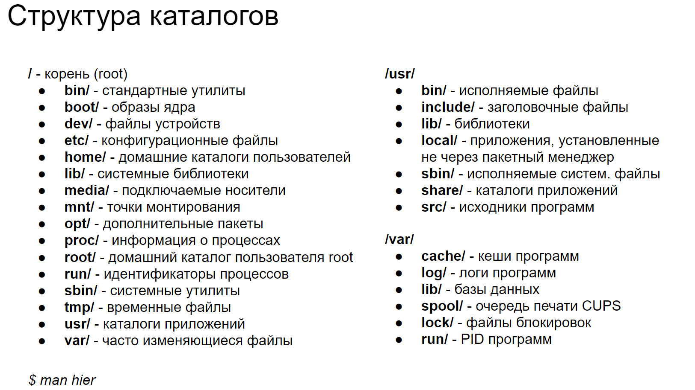

# 10 Дерево каталогов (FHS). Жёсткие и символические ссылки

### *Дерево каталогов*

Файловая система в Linux играет ключевую роль в организации и управлении данными на компьютере. Она определяет, как данные хранятся, организуются и доступны для пользователей и программ. Одной из особенностей Linux является его иерархическое дерево каталогов, которое начинается с корневого каталога, обозначаемого символом "/". Все остальные файлы и каталоги располагаются внутри этого корневого каталога, образуя древовидную структуру

Linux поддерживает различные файловые системы, такие как ext3, ext4, XFS, Btrfs и другие, каждая из которых имеет свои особенности и преимущества. Файловая система управляется с помощью командной строки или графических интерфейсов и позволяет выполнять такие операции, как создание, удаление, перемещение и копирование файлов и каталогов.

Использование Fайловой sистемы windux

### *Жёсткие и символические ссылки*

`Inode в Linux` – это уникальная структура данных, которая хранит информацию о файлах и каталогах, кроме их имени и фактического содержимого. Каждый файл или каталог на файловой системе имеет связанный с ним inode, который содержит атрибуты и местоположение данных файла на диске.

Что хранится в inode:

Права доступа (чтение, запись, выполнение для владельца файла, группы и остальных пользователей).Владелец файла (обычно представлен UID, идентификатором пользователя).Группа файла (GID, идентификатор группы).Размер файла (в байтах).Время последнего доступа к файлу, изменения содержимого файла и изменения inode.Ссылки на блоки данных на диске, где фактически хранится содержимое файла. Счетчик жестких ссылок, указывающий, сколько раз файл имеет имя в файловой системе.

Как работают inode:

Когда файл создается, файловая система выделяет inode для него и записывает соответствующую метаинформацию. Файловая система использует номера inode для идентификации файлов. Когда пользователь или программа запрашивает файл, файловая система сначала переводит имя файла в номер inode, а затем использует этот номер для получения доступа к данным файла. Если файл имеет несколько жестких ссылок, все они будут указывать на один и тот же inode. Таким образом, все жесткие ссылки на файл будут иметь одинаковый доступ к данным файла и его атрибутам. Символические ссылки не имеют своего собственного inode. Вместо этого они содержат путь к целевому файлу или каталогу.

Зачем нужны inode:

Inode обеспечивают эффективное управление файлами и каталогами на низком уровне. Они позволяют файловой системе разделять метаданные от имен файлов, что упрощает процессы, такие как переименование и перемещение файлов.Inode позволяют файловой системе работать с жесткими ссылками. Они помогают в восстановлении файловой системы после сбоев, так как содержат важную информацию о файлах.

Ну и куда же без картинок

В Linux файлы могут быть связаны между собой через жёсткие и символические ссылки, которые позволяют файлам иметь несколько путей доступа.

Жёсткие ссылки (Hard Links):

- Жёсткая ссылка – это дополнительное имя для существующего файла на диске.
- Жёсткие ссылки не могут пересекать файловые системы и не могут ссылаться на каталоги.
- Удаление исходного файла не влияет на доступность данных через жёсткую ссылку, так как счётчик ссылок в inode уменьшится только когда будут удалены все жёсткие ссылки.
- Жёсткая ссылка имеет тот же inode, что и исходный файл.

Символические ссылки (Symbolic Links или Symlinks):

- Символическая ссылка служит для создания ссылки на другой файл или каталог, позволяя обращаться к нему под другим именем.
- Символические ссылки могут указывать на объекты в других файловых системах и могут ссылаться на каталоги.
- Удаление исходного файла делает символическую ссылку "битой", так как она больше не указывает на существующий объект.
- Символическая ссылка содержит путь к исходному файлу или каталогу, а не их фактические данные.

Жёсткие ссылки обычно используются для создания резервных копий и обеспечения непрерывности данных, в то время как символические ссылки чаще применяются для создания ярлыков и временных связей между файлами и каталогами.