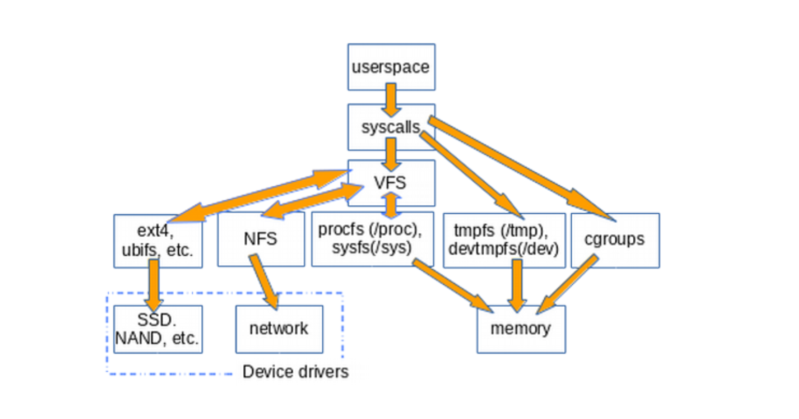
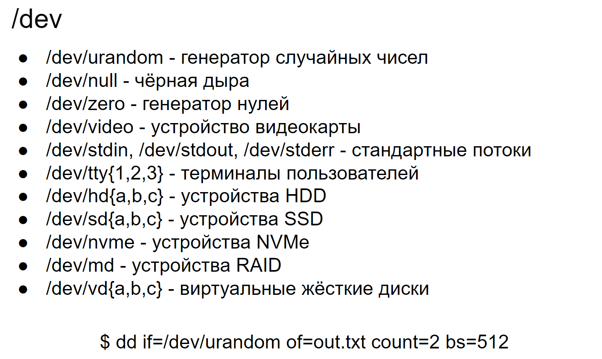

# 11 Виртуальные файловые системы /proc, /sys, /dev. Устройства и работа с ext*

### *Виртуальные файловые системы*

В Linux, виртуальные файловые системы `/proc`, `/sys`, и `/dev` играют важную роль в взаимодействии с ядром и аппаратным обеспечением. Они представляют собой интерфейсы для доступа к информации о системе и управления ею.

На приведенной ниже диаграмме показано, как userspace обращается к различным типам файловых систем, обычно монтируемых в системах Linux. Не показаны такие конструкции как `pipes`, `dmesg` и `POSIX clocks`, которые также реализуют структуру `file_operations`, доступ к которым проходит через слой VFS.
VFS — это «слой оболочки» между системными вызовами и реализациями определенных file_operations, таких как ext4 и procfs. Функции file_operations могут взаимодействовать либо с драйверами устройств, либо с устройствами доступа к памяти. tmpfs, devtmpfs и cgroups не используют file_operations, а напрямую обращаются к памяти. Существование VFS обеспечивает возможность переиспользовать код, так как основные методы, связанные с файловыми системами, не должны быть повторно реализованы каждым типом файловой системы. Переиспользование кода – широкоприменяемая практика программных инженеров! Однако, если повторно используемый код содержит серьезные ошибки, от них страдают все реализации, которые наследуют общие методы.

`/proc`

Это виртуальная файловая система, которая предоставляет доступ к информации о процессах и общей системной информации. Она не занимает места на диске, так как является интерфейсом к структурам данных в памяти ядра. В `/proc` можно найти каталоги, именованные числами, которые соответствуют идентификаторам процессов (PID). Внутри этих каталогов содержится информация о каждом процессе. Также здесь есть файлы, такие как `/proc/cpuinfo`, `/proc/meminfo` и `/proc/net`, которые предоставляют информацию о CPU, памяти и сетевых интерфейсах соответственно.

`/sys`

Виртуальная файловая система sysfs используется для предоставления информации о устройствах и драйверах, а также для их настройки .Она представляет собой иерархическое представление устройств, которые ядро распознает и управляет, и позволяет пользователю читать и иногда записывать атрибуты устройств для изменения их поведения. Например, `/sys/class/net` содержит информацию о сетевых интерфейсах.

`/dev`

Файловая система `/dev` содержит специальные файлы устройств, которые представляют аппаратные устройства. Существуют два основных типа файлов устройств: символьные (char devices) и блочные (block devices). Символьные устройства передают данные посимвольно, в то время как блочные устройства передают данные блоками .Примеры устройств в `/dev` включают `/dev/sda` (первый жесткий диск), `/dev/tty` (терминалы), `/dev/random` и `/dev/null`.

### *Файловые системы ext*

Файловые системы серии ext (от ext2 до ext4) являются одними из основных файловых систем, используемых в операционных системах на базе Linux. Они разработаны для хранения, управления и доступа к данным на жестком диске. Давайте рассмотрим каждую из них более подробно, чтобы понять их устройство и особенности работы.

### `*Ext2 (Second Extended Filesystem)*`

Ext2 была представлена в 1993 году как замена для оригинальной файловой системы ext. Она внесла значительные улучшения в производительность и надежность.

Основные характеристики:

- Нежурналированная файловая система: Ext2 не использует журналирование, что делает ее быстрее в некоторых сценариях, но менее надежной при сбоях питания или системных сбоях.
- Структура: Файловая система использует блоки для хранения данных и inode для хранения метаданных о файлах. Каждый файл или каталог связан с inode, который хранит информацию о размере файла, правах доступа, времени модификации и местоположении данных на диске.
- Использование: Ext2 часто используется на флеш-накопителях и в других ситуациях, где журналирование может привести к избыточному износу носителя.

### `*Ext3 (Third Extended Filesystem)*`

Ext3 была представлена в конце 1990-х годов и стала первой файловой системой ext, поддерживающей журналирование.

Основные характеристики:

- Журналирование: Ext3 добавляет поддержку журналирования, что значительно улучшает надежность и уменьшает время восстановления после сбоев. Журналирование записывает изменения в специальный журнал на диске перед тем, как они будут применены к файловой системе, что позволяет быстро восстановиться после сбоев.
- Обратная совместимость: Ext3 обратно совместима с Ext2, что позволяет монтировать файловые системы Ext2 как Ext3 без потери данных.
- Режимы журналирования: Ext3 поддерживает три режима журналирования: журналирование всех метаданных и данных (journal), только метаданных (ordered) и журналирование метаданных с игнорированием данных (writeback).

### `*Ext4 (Fourth Extended Filesystem)*`

Ext4 была представлена в 2008 году как развитие Ext3, предлагая улучшенную производительность, масштабируемость и надежность.

Основные характеристики:

- Улучшенная масштабируемость и производительность: Ext4 поддерживает большие объемы (до 1 эксабайта) и размеры файлов (до 16 терабайт), а также использует улучшенные алгоритмы распределения блоков.
- Журналирование с отложенной записью: Ext4 использует механизмы отложенной записи, что улучшает производительность и уменьшает износ SSD.Фрагментация: Ext4 вводит механизмы для борьбы с фрагментацией файлов, улучшая производительность при работе с большими файлами.
- Поддержка журналирования: Как и Ext3, Ext4 поддерживает различные режимы журналирования, но с улучшенной эффективностью и надежностью.

Работа с файловыми системами Ext* в Linux:

- Создание: `mkfs.ext4 /dev/sdX` для форматирования раздела в Ext4.
- Проверка: `fsck.ext4 /dev/sdX` проверяет и исправляет ошибки файловой системы.
- Монтирование: `mount /dev/sdX /mnt` позволяет монтировать файловую систему для доступа к ее содержимому.
- Работа с файлами и каталогами осуществляется через стандартные команды Linux, такие как `ls`, `cp`, `mv`, `rm`.

Каждая версия файловой системы ext вносит улучшения в производительность, надежность и функциональность, делая их подходящим выбором для широкого спектра сценариев использования.