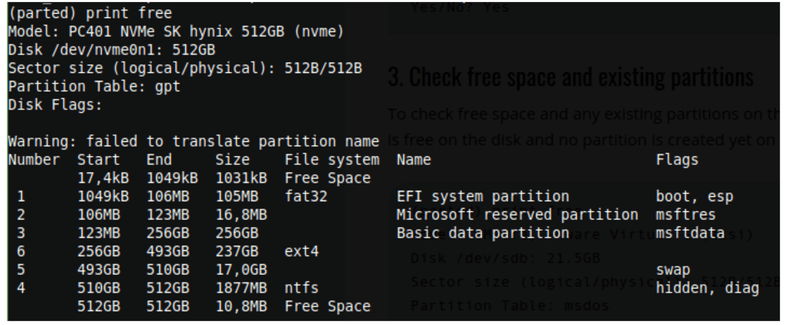

# 12 Разделы ЖД. Сравнение файловых систем

Разделы жесткого диска (ЖД) позволяют разделить физический накопитель на несколько логических секций, каждая из которых может быть отформатирована с использованием различных файловых систем. Это обеспечивает гибкость в управлении данными, установке операционных систем и оптимизации производительности.

### *Основные и расширенные разделы*

- Основные разделы (Primary Partitions): Это разделы, которые могут содержать операционную систему. На одном диске может быть до четырех основных разделов.
- Расширенные разделы (Extended Partitions): Если нужно больше четырех разделов, один из основных разделов можно преобразовать в расширенный раздел, внутри которого можно создать множество логических разделов.

### *Мастер-запись загрузочного сектора (MBR) и таблица разделов GUID (GPT)*

- MBR (Master Boot Record): Традиционная система разделов, которая поддерживает до четырех основных разделов и ограничена размером диска в 2 ТБ.
- GPT (GUID Partition Table): Новая система разделов, которая поддерживает до 128 основных разделов по умолчанию и не ограничена 2 ТБ. GPT более надежна благодаря наличию резервных копий таблицы разделов и CRC-проверок для обнаружения ошибок.

### *Разделы для специфических целей*

- Загрузочный раздел (Boot Partition): Содержит файлы, необходимые для загрузки операционной системы.
- Раздел подкачки (Swap Partition): Используется в системах Linux как расширение оперативной памяти. Когда оперативная память заполнена, система может использовать раздел подкачки для временного хранения данных.
- Домашний раздел (Home Partition): В Linux это раздел, где обычно хранятся пользовательские файлы и настройки.
- Раздел восстановления (Recovery Partition): Содержит инструменты и данные, необходимые для восстановления или переустановки операционной системы.

Просмотр всех разделов

Примеры работы с разделами

Создание пустого файла

`$ sudo dd if=/dev/zero of=/disk.img count=2000 bs=1M`

Будем создавать в нём файловую систему

`$ sudo parted disk.img`

Разметим под GPT

`(parted) mktable gpt`

Создадим раздел и отформатируем в ext4

`(parted) mkpart primary ext4 0 -0М`

Подключаем как блочное устройство

`$ losetup --partscan --show --find disk.img`

### *Файловые системы*

Каждый раздел может быть отформатирован с использованием различных файловых систем, таких как NTFS для Windows, Ext4 для Linux, HFS+ или APFS для macOS, FAT32 или exFAT для обмена данными между разными системами.

Рассмотрим основные файловые системы, их характеристики и сравним их.

### `*NTFS*`

Использование: Широко используется в операционных системах Windows.Особенности:

Поддержка больших файлов и томов. Встроенные механизмы безопасности, включая шифрование и управление доступом на уровне файлов. Журналирование для устойчивости к сбоям.

### `*FAT32*`

Использование: Общее использование, совместимо с большинством операционных систем. Особенности:

Простота и широкая совместимость. Ограничение размера файла в 4 ГБ и размера тома в 8 ТБ. Отсутствие встроенных механизмов безопасности и журналирования.

### `*exFAT*`

Использование: Флеш-накопители, SD-карты, внешние жесткие диски. Особенности:

Поддержка файлов и томов большого размера, превышающих ограничения FAT32.Лучшая совместимость с различными устройствами по сравнению с NTFS.Отсутствие журналирования и ограниченные функции безопасности.

### `*Ext4*`

Использование: Широко используется в системах на базе Linux. Особенности:

Поддержка больших файлов и томов. Журналирование для улучшения надежности и скорости восстановления после сбоев. Расширенные функции, такие как отложенная аллокация и фрагментация.

### `*HFS+ (Mac OS Extended)*`

Использование: Используется в macOS до введения APFS. Особенности:

Поддержка метаданных, журналирование и шифрование. Оптимизирована для работы с большими файлами и томами. Тесная интеграция с macOS, включая поддержку Time Machine.

### `*APFS (Apple File System)*`

Использование: macOS, iOS, tvOS, watchOS. Особенности:

Повышенная производительность и надежность. Поддержка шифрования на уровне файловой системы. Оптимизация для SSD и флеш-накопителей.

Сравнение:

- Производительность: Ext4 и APFS обеспечивают высокую производительность и оптимизированы под современные носители. NTFS также предлагает хорошую производительность, но может быть менее эффективен на некоторых не-Windows платформах.
- Надежность: Файловые системы с поддержкой журналирования, такие как NTFS, Ext4 и APFS, обеспечивают высокую надежность и устойчивость к сбоям.
- Совместимость: FAT32 и exFAT обеспечивают наилучшую совместимость между различными операционными системами, но имеют ограничения по размеру файлов и томов.
- Функции безопасности: NTFS, Ext4, HFS+, и APFS предлагают расширенные функции безопасности, включая управление доступом и шифрование.

Выбор файловой системы зависит от требований к производительности, надежности, совместимости и безопасности, а также от используемой операционной системы и типа накопителя.