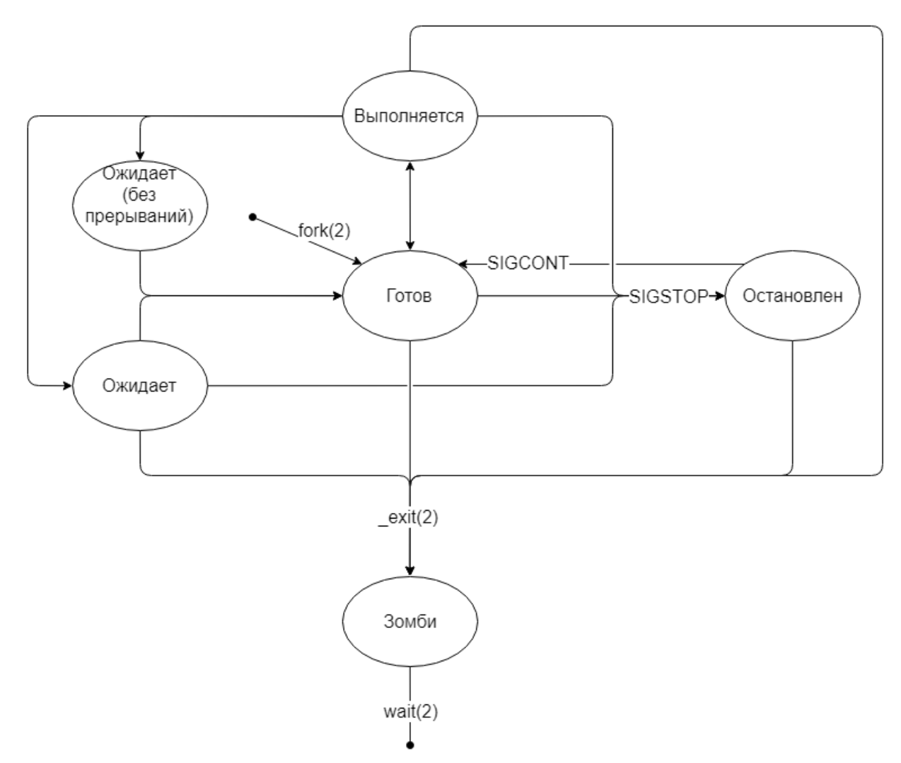

# 17 Создание и жизненный цикл процесса. Основные сигналы

### *Создание процесса*

`fork()` Системный вызов, который создает новый процесс путем копирования текущего процесса. Новый процесс называется дочерним и имеет свой собственный идентификатор процесса (PID).

`exec()` После вызова fork() новая программа может быть загружена в адресное пространство нового процесса с помощью exec(). Это позволяет дочернему процессу выполнять другую программу.

Вот еще какой-то код (создание процесса)

```bash
int pid = fork();
	switch(pid) {
			case 0:
// Child
break;
default:
// Parent
break;
}
```

Жизненный цикл процесса



Состояния процесса:
`Готов (Ready)`Процесс создан и готов к выполнению.
Процесс попадает в это состояние после создания через fork().
`Выполняется (Running)` Процесс исполняется процессором.
Процесс переходит в это состояние из состояния "Готов".
`Ожидает (Waiting/Blocked)` Процесс ждет завершения события (например, завершение ввода-вывода).
Существует два типа ожидания:
`Ожидает (без прерываний)` Процесс не может быть прерван и ждет до завершения текущего действия.
`Ожидает` Процесс может быть прерван и вернуться в состояние "Готов" или "Выполняется".
`Остановлен (Stopped)`Процесс остановлен и не исполняется.
Переход в это состояние происходит по сигналу SIGSTOP.
`Зомби (Zombie)` Процесс завершился, но его запись в таблице процессов еще не удалена.
Переход в это состояние происходит после завершения с помощью _exit() вызова.
`Завершение (Terminated)` Процесс завершил выполнение.
Процесс уходит из состояния зомби после получения вызова wait().
Основные системные вызовы:
`fork()` Создает новый процесс, который является копией текущего процесса.
`exec()` Заменяет текущий процесс новой программой.
`wait()` Ожидание завершения дочернего процесса.
`exit()`  Завершает выполнение текущего процесса.

**Основные сигналы в Linux**

| Название | Код | Действие | Значение | Пояснение дяди Вани |
| --- | --- | --- | --- | --- |
| SIGTERM | 15 | Завершить | Вежливо попросить процесс завершить работу и подчистить за собой мусор. | Завершение (Terminate) - запрашивает мягкое завершение процесса. |
| SIGSTOP | 23 | Остановить | Остановить выполнение процесса. Ctrl+Z | Ну типа остановка процесса. Тут и добавить нечего |
| SIGKILL | 9 | Завершить | Немедленно прекратить выполнение процесса. Нельзя обработать или перехватить. | Безусловное завершение (Kill) - прекращает выполнение процесса немедленно. |
| SIGINT | 2 | Завершить | Прервать выполнение процесса. Отправляется только с терминала. Ctrl+C | Прерывание (Interrupt) - обычно генерируется нажатием Ctrl+C. |
| SIGHUP | 1 | Завершить | Прервать выполнение процесса, т.к. терминал закрыт. Для демонов - обновить конфигурацию. | Сигнал "повисания" (Hangup) - часто используется для перезагрузки процесса. |
| SIGSEGV | 11 | Завершить + core dump | Аварийно завершить работу процесса, т.к. он обратился к недоступным ресурсам. | ;) |
| SIGABRT | 6 | Завершить + core dump | Аварийно завершить работу процесса, т.к. он вызвал системный метод abort(). | ⛧ |