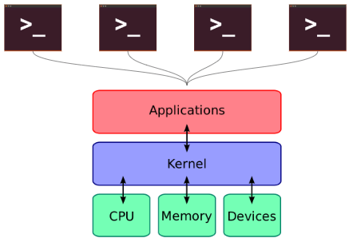
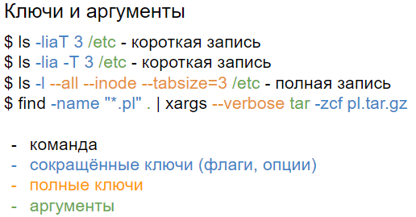
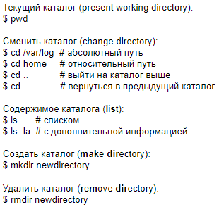
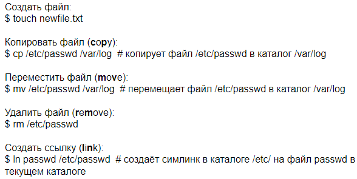

# 2 Терминал bash и его основные возможности. Полные и сокращённые ключи и аргументы команд. Навигация по каталогам и работа с файлами

*BASH (Bourne Again Shell) и основные возможности*

Коротко говоря, через терминал можно получать доступ не только к приложениям и ядру, но и процессору, памяти и подключённым устройствам

- Ввод и выполнение команд
- Просмотр истории команд
- Написание скриптов для автоматизации задач
- Использование переменных и циклов (потому что это ЯП)
- Перенаправление вывода команд: >, >>, <
- Манипуляции с каналами (pipes): |
- Навигация: `cd`, `ls`, `pwd`
- Управление файлами: `cp`, `mv`, `rm`, `touch`

*Полные и сокращённые ключи и аргументы команд*

Пример:

`find / -type f -name *.conf -user root -size +20k -newermt 2020-03-03 -exec ls -la {} \; 2>/dev/null` - выполняет поиск по следующий фильтрам: `-type f` - тип файлов; `-name *.conf` - любое имя с расширением `.conf`; `-user root` - владелец `root`; `-size +20k` - размер больше 20КБ; `-newermt 2020-03-03` - были созданы после 3 марта 2020; `-exec ls -la {} \;` - к каждому результату запроса применяет `la -ls`; `2>/dev/null` - перенаправляет ошибки из терминала (чтобы их не было видно)

*Навигация по каталогам и работа с файлами*

