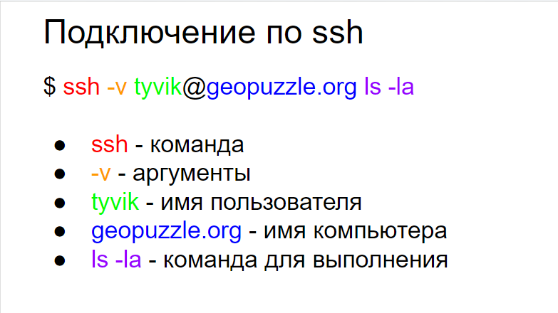
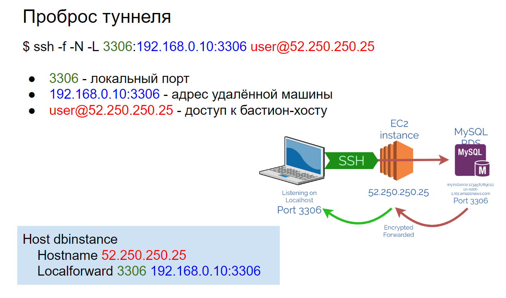
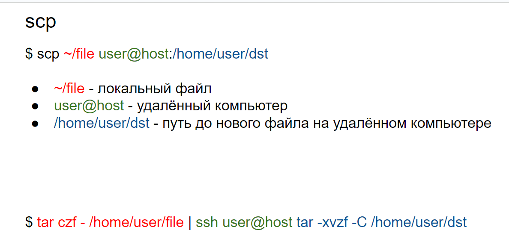

# 25 Подключение по ssh. Проброс туннеля. Копирование файлов на сервер

### Подключение по ssh:



**Файл `~/.ssh/config` — это конфигурационный файл для клиента SSH, который находится в домашней директории пользователя. Этот файл позволяет задавать параметры подключения SSH для различных хостов, что упрощает и автоматизирует процесс подключения к удалённым серверам. Вот пример содержимого такого файла:**

```csharp
Host example
    HostName example.com
    User yourusername
    Port 22
    IdentityFile ~/.ssh/id_rsa
    LogLevel INFO
    ServerAliveInterval 120
    ForwardAgent yes
    ForwardX11 yes
```

**В этом примере, когда вводится команда `ssh example`, SSH автоматически использует указанные параметры для подключения к `example.com` с именем пользователя `yourusername` и ключом `~/.ssh/id_rsa`.**

## Проброс туннеля



    **Проброс туннеля (или туннелирование) в SSH позволяет пересылать сетевые трафики через зашифрованное соединение SSH. Это полезно для защиты данных, обхода сетевых ограничений или доступа к внутренним ресурсам сети.**

Команда с слайда:

```csharp
$ ssh -f -N -L 3306:192.168.0.10:3306 user@52.250.250.25
```

**настраивает проброс локального порта через SSH-туннель.**

**Что делает эта команда:**

**Устанавливает SSH-соединение с сервером `52.250.250.25` под пользователем `user`.Настраивает туннель, который пробрасывает локальный порт `3306` на вашем компьютере к порту `3306` на хосте `192.168.0.10` через сервер `52.250.250.25`.**

    **После выполнения этой команды, можно подключаться к локальному порту `3306` на своем компьютере, и трафик будет автоматически пересылаться через SSH-туннель к порту `3306` на `192.168.0.10`. Это может быть полезно, например, для доступа к базе данных MySQL, работающей на `192.168.0.10`, через защищённое SSH-соединение**

### Копирование файлов на сервер



**Для этого часто используются команды и утилиты, такие как `scp` (Secure Copy) и `rsync`.**

### **1. `scp` (Secure Copy)**

**`scp` — это утилита для безопасного копирования файлов между локальным и удалённым хостами через SSH. Она проста в использовании и поддерживает передачу файлов и директорий.**

### **Примеры использования `scp`:**

    **a) Копирование файла на удалённый сервер:**

```csharp
  **scp /path/to/local/file user@remote_host:/path/to/remote/directory**
```

**В этом примере файл `/path/to/local/file` будет скопирован в директорию `/path/to/remote/directory` на удалённом сервере `remote_host` под пользователем `user`.**

    **b) Копирование файла с удалённого сервера на локальный компьютер:**

```csharp
  **scp user@remote_host:/path/to/remote/file /path/to/local/directory**
```

**В этом примере файл `/path/to/remote/file` будет скопирован в директорию `/path/to/local/directory` на вашем локальном компьютере.**

### **2. `rsync`**

**`rsync` — это мощная утилита для синхронизации и копирования файлов и директорий. Она поддерживает инкрементное копирование, что делает её особенно полезной для передачи больших объёмов данных и регулярных резервных копий.**

### **Примеры использования `rsync`:**

    **a) Копирование файлов на удалённый сервер:**

```csharp
**rsync -avz /path/to/local/directory user@remote_host:/path/to/remote/directory**
```

**В этом примере:**

- `a` (archive) сохраняет права доступа, временные метки и другие атрибуты.
    - `v` (verbose) включает подробный вывод.
    - `z` (compress) сжимает данные во время передачи для уменьшения объёма передаваемых данных.

    ****

    **b) Копирование файлов с удалённого сервера на локальный компьютер:**

```csharp
**rsync -avz user@remote_host:/path/to/remote/directo**
```