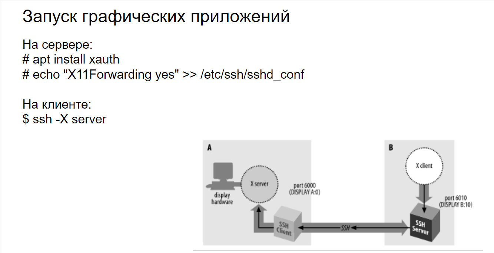
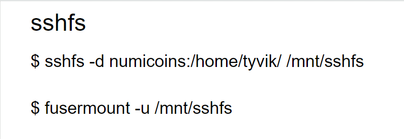
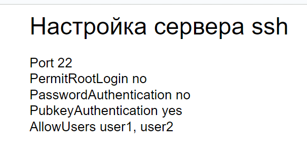
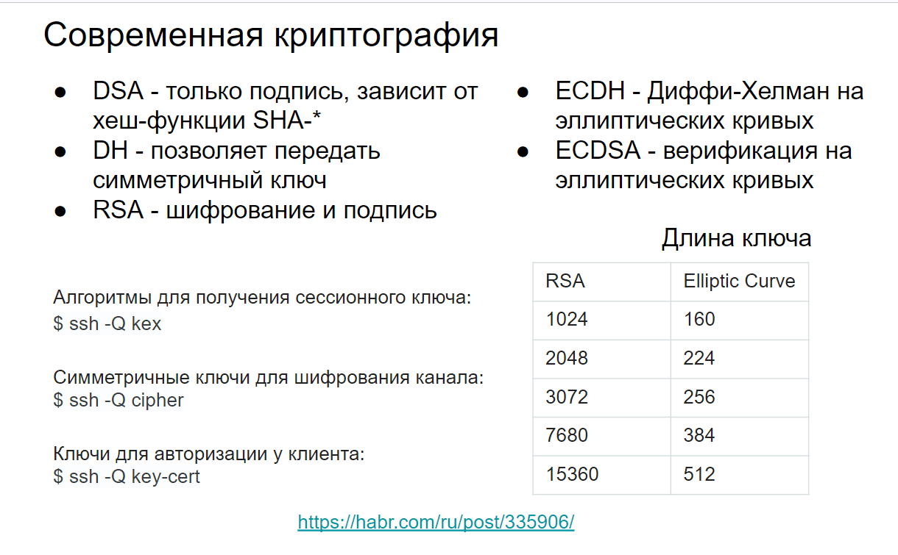

# 26 Настройка ssh клиента и сервер. Криптография DSA/ECDSA, её применение

## Настройка ssh клиента и сервер

**Настройка сервера для запуска графических приложений.**

**Запуск графических приложений на удалённом сервере через SSH возможен благодаря технологии X11 Forwarding.**



1. **Установка `xauth` на сервере:**

    **`# apt install xauth`**

1. **Включение X11 Forwarding:
   `# echo "X11Forwarding yes" >> /etc/ssh/sshd_config`**
2. **Перезапуск SSH демона:
   `# systemctl restart sshd`** 

### **Настройка клиента для запуска графических приложений**



**Подключение к серверу с включённым X11 Forwarding:
   `$ ssh -X user@server_address`**

### **Монтирование удалённой файловой системы с помощью `sshfs`**

> **Монтирование — это процесс, при котором файловая система становится доступной для использования в определённой точке файловой системы операционной системы. Это позволяет пользователям и приложениям взаимодействовать с файлами и директориями, как если бы они находились на одном физическом устройстве, даже если на самом деле они могут находиться на разных устройствах или даже на удалённых серверах.**
> 

```csharp
$ sshfs -d numicoins:/home/tyvik/ /mnt/sshfs
```

### **Объяснение:**

1. **`sshfs`: Это утилита, которая позволяет монтировать удалённые файловые системы через SSH.**
2. **`-d`: Эта опция включает отладочный режим (debug mode), что позволяет видеть подробный вывод о процессе монтирования.**
3. **`numicoins:/home/tyvik/`: Это удалённый путь, который вы хотите смонтировать. В данном случае, вы монтируете директорию `/home/tyvik/` на удалённом хосте `numicoins`.**
4. **`/mnt/sshfs`: Это локальная точка монтирования, куда будет смонтирована удалённая файловая система. В данном случае, это директория `/mnt/sshfs` на вашем локальном компьютере.**

### **Пример:**

**После выполнения этой команды, содержимое директории `/home/tyvik/` на удалённом хосте `numicoins` будет доступно как если бы оно находилось в директории `/mnt/sshfs` на вашем локальном компьютере.**

### **Настройка SSH сервера**



1. **Изменение порта SSH:
   `Port 22`**
2. **Запрет входа под root:
   `PermitRootLogin no`**
3. **Отключение аутентификации по паролю:
   `PasswordAuthentication no`**
4. **Включение аутентификации по ключу:
   `PubkeyAuthentication yes`**
5. **Разрешение входа только определённым пользователям:
   `AllowUsers user1 user2`**

### **Итоговая конфигурация файла `/etc/ssh/sshd_config`:**

```csharp
**Port 22
PermitRootLogin no
PasswordAuthentication no
PubkeyAuthentication yes
AllowUsers user1 user2
X11Forwarding yes**
```

### **Перезапуск SSH демона после изменений:
`# systemctl restart sshd`**

**Теперь сервер настроен для безопасного доступа и поддержки графических приложений, а также для монтирования удалённых файловых систем с помощью `sshfs`.**

---

## Криптография DSA/ECDSA, её применение



**Современная криптография включает в себя множество алгоритмов и протоколов, каждый из которых предназначен для решения определённых задач в области безопасности. Рассмотрим подробнее DSA и ECDSA, а также их применение.**

### **DSA (Digital Signature Algorithm)**

- **Назначение: DSA используется исключительно для создания цифровых подписей.**
- **Зависимость от хеш-функции: DSA зависит от хеш-функции SHA-* (например, SHA-1, SHA-256 и т.д.), которая используется для создания хеша от сообщения.**
- **Применение: DSA широко применяется для аутентификации и обеспечения целостности данных. Он используется в различных протоколах и стандартах, таких как SSH, TLS и других.**

### **ECDSA (Elliptic Curve Digital Signature Algorithm)**

- **Назначение: ECDSA также используется для создания и верификации цифровых подписей, но основан на математике эллиптических кривых.**
- **Преимущества: ECDSA предлагает более высокую безопасность при меньших размерах ключей по сравнению с традиционными алгоритмами, такими как DSA и RSA.**
- **Применение: ECDSA используется в различных современных криптографических протоколах, включая SSH, TLS, и в криптовалютных системах, таких как Bitcoin.**

### **Другие криптографические алгоритмы**

- **DH (Diffie-Hellman): Позволяет безопасно передать симметричный ключ между двумя сторонами, не передавая сам ключ по незащищённому каналу.**
- **RSA: Используется как для шифрования, так и для создания цифровых подписей. RSA является одним из самых распространённых алгоритмов в криптографии.**
- **ECDH (Elliptic Curve Diffie-Hellman): Вариант алгоритма Диффи-Хелмана, использующий эллиптические кривые для повышения безопасности и эффективности.**

---

### **Примеры использования криптографических алгоритмов в SSH**

- **Получение списка алгоритмов для обмена сессионными ключами:**

```csharp
  $ ssh -Q kex
```

- **Получение списка симметричных ключей для шифрования канала:**

```csharp
  $ ssh -Q cipher
```

- **Получение списка ключей для авторизации у клиента:**

```csharp
  $ ssh -Q key-cert
```

**Эти команды позволяют узнать, какие алгоритмы поддерживаются текущей версией SSH, что важно для настройки и обеспечения безопасности соединений.**

### **Заключение**

**DSA и ECDSA являются важными компонентами современной криптографии. DSA используется для создания цифровых подписей, тогда как ECDSA предлагает более высокую безопасность и эффективность благодаря использованию эллиптических кривых. Понимание и правильное применение этих алгоритмов критически важно для обеспечения безопасности данных и коммуникаций в цифровом мире.**