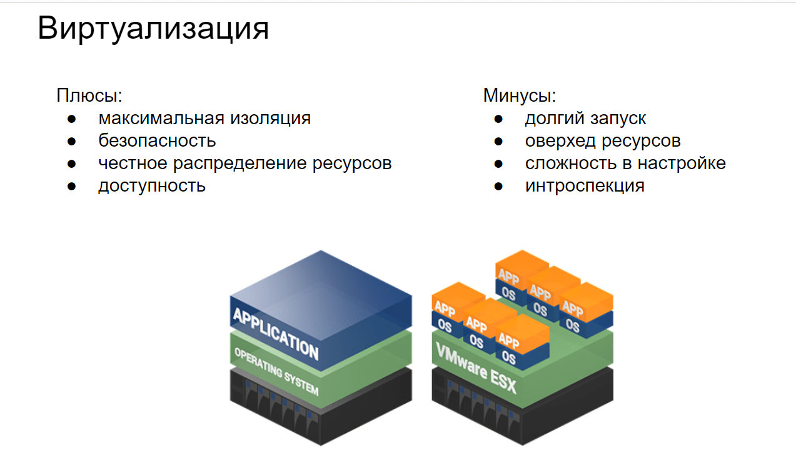
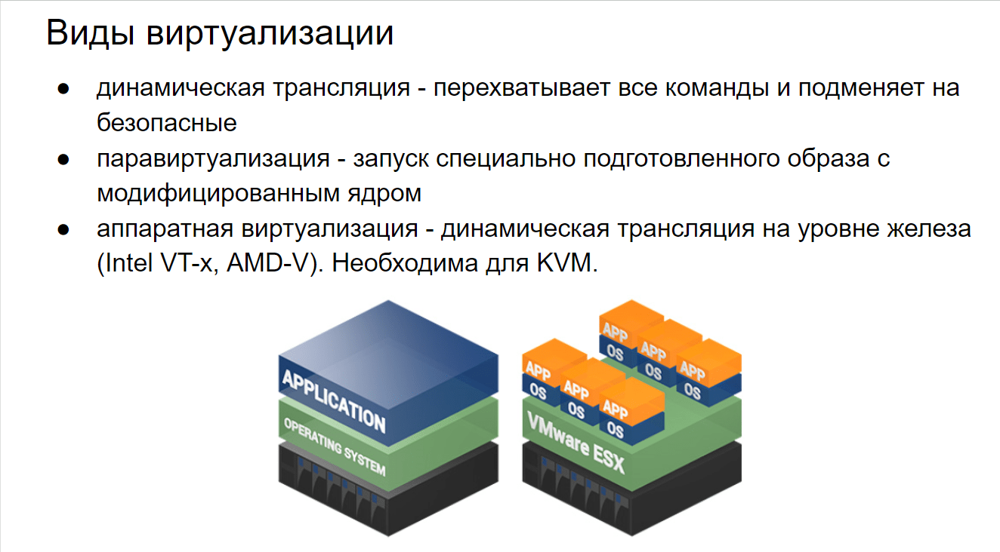
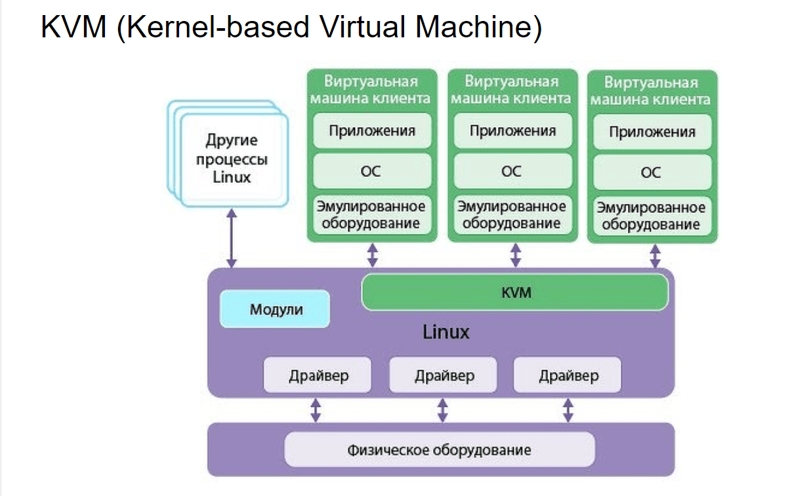
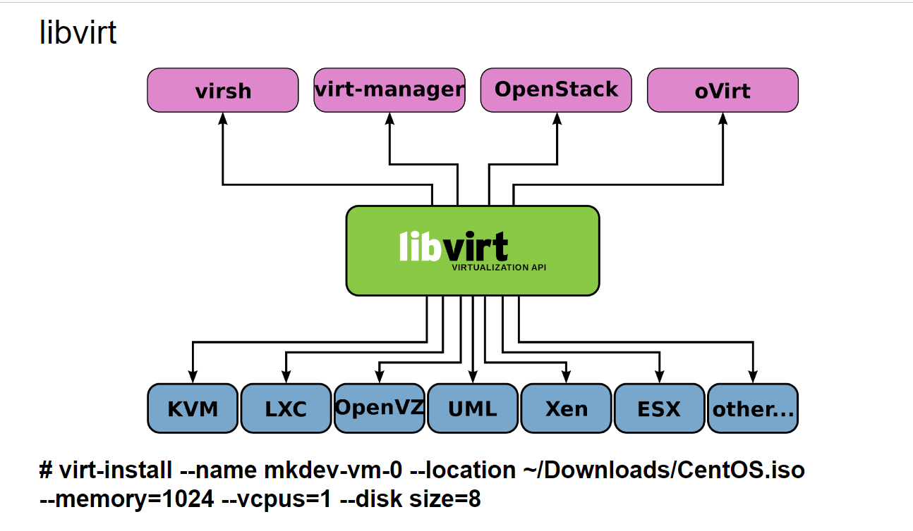

# 27 История виртуализации. Виды виртуализации. Программы для виртуализации

## История виртуализации

> **Виртуализация — это технология, которая позволяет создавать виртуальные версии вычислительных ресурсов, таких как операционные системы, серверы, хранилища и сети. Она прошла долгий путь развития, начиная с 1960-х годов.**
> 

## **Ключевые этапы в истории виртуализации.**

- **1960-е: Рождение виртуализации**
    - **IBM и мейнфреймы: Виртуализация зародилась в 1960-х годах с развитием мейнфреймов IBM. IBM разработала технологию виртуальных машин (VM) для своих систем серии 360/67. Эта технология позволяла создавать несколько виртуальных машин на одном физическом мейнфрейме, что обеспечивало лучшую изоляцию и управление ресурсами.**
- **1970-е: Развитие концепции**
    - **CP/CMS: В 1972 году IBM выпустила операционную систему CP/CMS (Control Program/Cambridge Monitor System), которая стала основой для дальнейшего развития виртуализации. CP/CMS позволяла пользователям запускать несколько копий операционной системы CMS на одном мейнфрейме.**
    - **VM/370: В 1972 году IBM представила VM/370, которая стала первой коммерчески успешной системой виртуализации. VM/370 позволяла запускать несколько виртуальных машин на мейнфрейме, обеспечивая изоляцию и управление ресурсами.**
- **1980-е: Переход к персональным компьютерам**
    - **Появление персональных компьютеров: В 1980-х годах виртуализация начала постепенно перемещаться из мейнфреймов в мир персональных компьютеров. Однако, из-за ограниченных ресурсов ПК, виртуализация на этом этапе не получила широкого распространения.**
- **1990-е: Виртуализация на ПК**
    - **Появление VMware: В 1999 году компания VMware выпустила VMware Workstation, первый коммерческий продукт для виртуализации на персональных компьютерах. VMware Workstation позволяла запускать несколько операционных систем на одном ПК, что стало революцией в мире виртуализации.**
- **2000-е: Виртуализация на серверах**
    - **VMware ESX: В 2001 году VMware выпустила VMware ESX, гипервизор для серверов, который позволял предприятиям консолидировать серверные ресурсы и улучшить управление ИТ-инфраструктурой**
    - **Xen: В 2003 году был представлен гипервизор Xen с открытым исходным кодом, который стал популярным выбором для виртуализации в корпоративных и облачных средах.**
    - **Microsoft Hyper-V: В 2008 году Microsoft выпустила Hyper-V, гипервизор для серверов, встроенный в Windows Server. Hyper-V стал конкурентом VMware и Xen в области серверной виртуализации.**
- **2010-е: Облачные вычисления и контейнеризация**
    - **Облачные платформы: Виртуализация стала основой для облачных вычислений. Такие платформы, как Amazon Web Services (AWS), Microsoft Azure и Google Cloud Platform, используют виртуализацию для предоставления масштабируемых и гибких облачных сервисов.**
    - **Контейнеризация: В середине 2010-х годов контейнеризация стала популярной альтернативой традиционной виртуализации. Docker, выпущенный в 2013 году, позволил разработчикам создавать контейнеры, которые изолируют приложения и их зависимости, что облегчает развертывание и управление приложениями.Kubernetes: В 2014 году Google представила Kubernetes, платформу для оркестрации контейнеров, которая стала стандартом де-факто для управления контейнерными приложениями в облаке.**
- **Современность: Гибридные и мультиоблачные среды**
    - **Гибридные облака: Современные организации все чаще используют гибридные облака, комбинируя локальные ресурсы с облачными сервисами. Виртуализация играет ключевую роль в обеспечении гибкости и управления в таких средах.**
    - **Мультиоблачные стратегии: Компании также используют мультиоблачные стратегии, распределяя свои приложения и данные между несколькими облачными провайдерами для повышения надежности и отказоустойчивости.**

## Виды виртуализации

## Программы для виртуализации

- **VMware Workstation: Это мощное решение для настольной виртуализации, которое позволяет запускать несколько операционных систем на одном компьютере. Поддерживает широкий спектр операционных систем и предоставляет множество функций для разработчиков и ИТ-специалистов.**
- **VirtualBox: Это бесплатное и открытое программное обеспечение для настольной виртуализации, поддерживающее различные операционные системы, включая Windows, Linux, macOS и другие. VirtualBox предоставляет множество функций, таких как снимки состояния (snapshots), обмен файлами между хостом и гостем, и поддержка 3D-графики.**
- **Hyper-V: Это гипервизор от Microsoft, встроенный в Windows Server и Windows 10 Pro/Enterprise. Hyper-V позволяет создавать и управлять виртуальными машинами, поддерживает виртуальные сети и обеспечивает высокую производительность для корпоративных приложений.**

**Libvirt — это открытая программная библиотека, которая предоставляет интерфейс для управления виртуализацией. Она поддерживает различные гипервизоры, включая KVM, QEMU, Xen, VMware ESXi, и другие. Libvirt позволяет администраторам и разработчикам управлять виртуальными машинами, сетями, хранилищами и другими аспектами виртуализации через унифицированный API.**