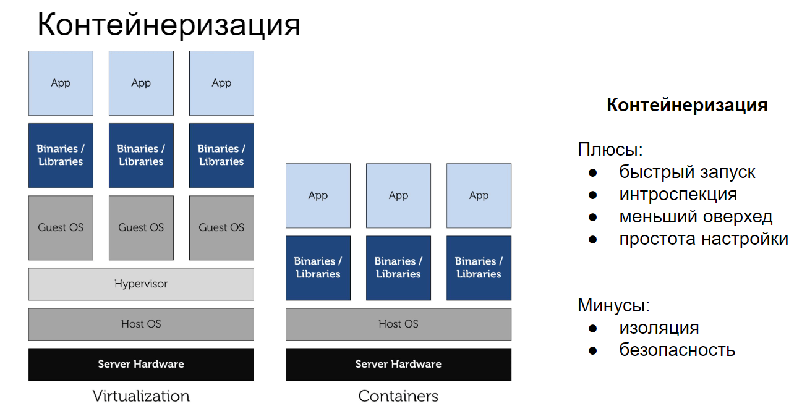
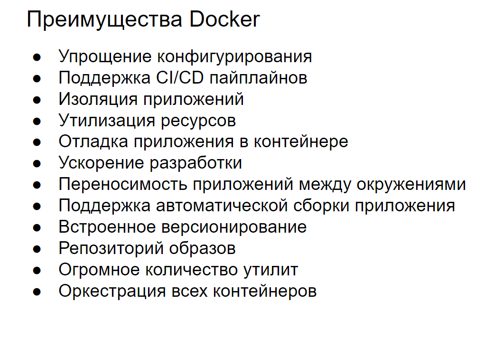
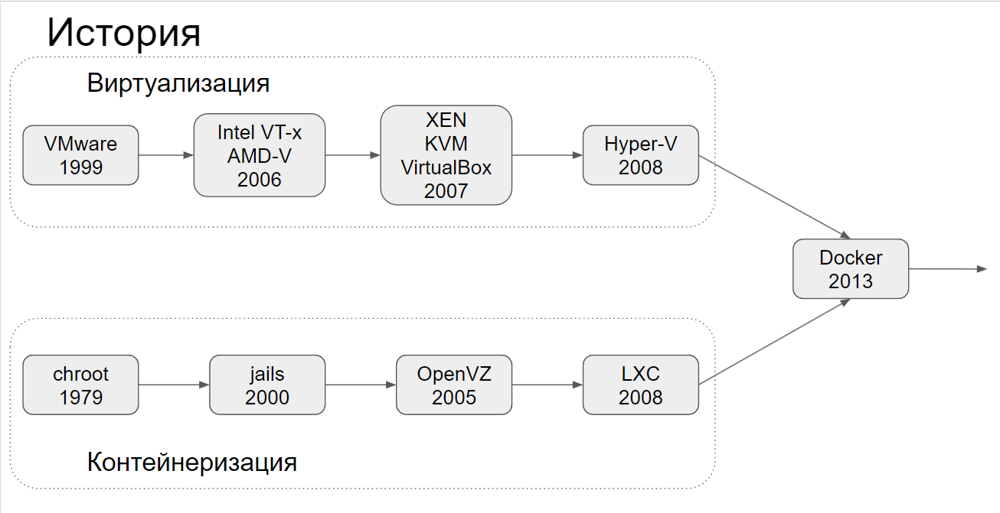
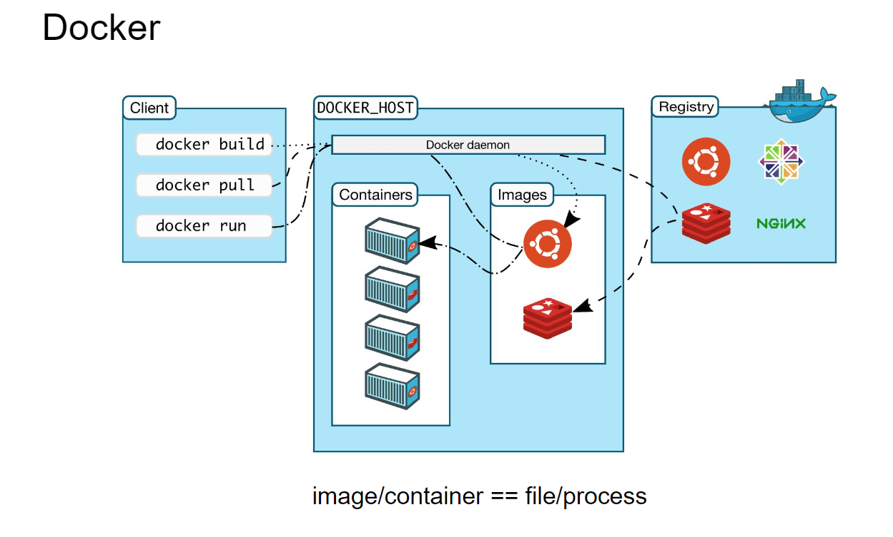
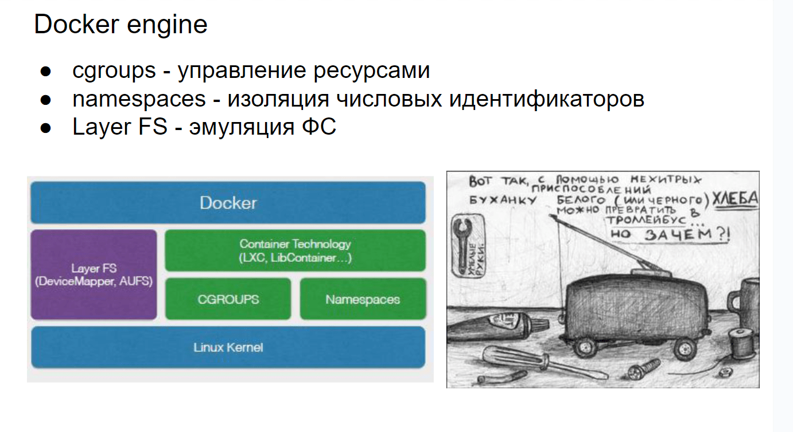
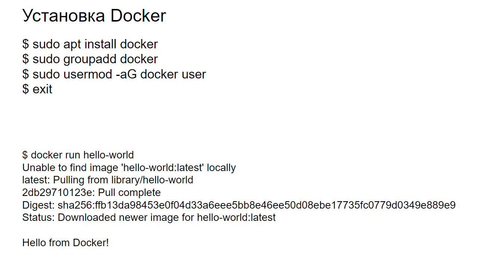

# 28 История контейнеризации. Инфраструктура Docker

## История контейнеризации

> **Контейнеризация — это технология, которая позволяет упаковывать приложения и их зависимости в изолированные контейнеры, обеспечивая их переносимость и консистентность при развертывании в различных средах. Контейнеры обеспечивают изоляцию приложений, что позволяет запускать несколько контейнеров на одном хосте без конфликтов между ними.**
> 

(Про минусы чет не понял, но решил оставить)

## Что написал про минусы Gpt

1. **Сложность управления: Управление большим количеством контейнеров может быть сложным, особенно в масштабных кластерах. Это требует использования инструментов оркестрации, таких как Kubernetes, которые сами по себе могут быть сложными в настройке и управлении.**
2. **Безопасность: Хотя контейнеры обеспечивают изоляцию, они все же используют общее ядро хостовой ОС. Это может представлять риск, если в ядре обнаружены уязвимости. Для обеспечения безопасности требуется дополнительная настройка и мониторинг.**
3. **Сетевые накладные расходы: Контейнеры могут добавлять дополнительные сетевые накладные расходы из-за использования виртуальных сетей и оверлейных сетевых технологий. Это может повлиять на производительность сетевых операций.**
4. **Ограниченная поддержка некоторых приложений: Не все приложения могут быть легко контейнеризованы. Некоторые старые или монолитные приложения могут требовать значительных изменений для работы в контейнерах.**
5. **Проблемы с хранением данных: Контейнеры по своей природе эфемерны, что может создать сложности при работе с данными, которые должны сохраняться между перезапусками контейнеров. Для решения этой проблемы используются внешние хранилища и тома, что добавляет дополнительный уровень сложности.**

## История

### **1. Ранние формы изоляции процессов**

- **1979: chroot в Unix:
Команда `chroot` в Unix была одним из первых инструментов для изоляции процессов. Она позволяла изменять корневой каталог для текущего процесса и его дочерних процессов, создавая изолированную файловую систему.**

### **2. Развитие изоляции на уровне ядра**

**2000-е: FreeBSD Jails:**

- **FreeBSD представила концепцию "jails" (тюрем), которая расширила возможности `chroot`, добавив изоляцию сети и процессов. Это позволило создавать более безопасные и изолированные окружения для запуска приложений.2001: Linux VServer:**
- **Linux VServer был одним из первых проектов, направленных на создание изолированных окружений на базе ядра Linux. Он позволял запускать несколько виртуальных серверов на одном физическом хосте.**

### **3. Контейнеризация в Linux**

**2006: OpenVZ:**

- **OpenVZ был одним из первых проектов контейнеризации на базе Linux, который предоставлял изоляцию на уровне операционной системы. Он позволял создавать виртуальные окружения с изолированными процессами, памятью, сетью и файловой системой.**

**2008: LXC (Linux Containers):**

- **LXC стал первым полноценным решением для контейнеризации в Linux, используя возможности cgroups (контрольные группы) и namespaces (пространства имен) для изоляции процессов. LXC предоставил более гибкие и мощные инструменты для создания и управления контейнерами.**

### **4. Эра Docker**

**2013: Запуск Docker:**

- **Docker, представленный компанией dotCloud (позже переименованной в Docker Inc.), стал революционным шагом в контейнеризации. Docker упростил создание, развертывание и управление контейнерами, предоставив удобные инструменты и стандартизированный формат контейнеров.**

**2014: Docker Hub:**

- **Docker Hub был запущен как центральный репозиторий для хранения и обмена Docker-образами. Это значительно упростило распространение и повторное использование контейнеров.**

## Инфраструктура Docker

> **Docker — это платформа для разработки, доставки и запуска контейнерных приложений. Она предоставляет все необходимые инструменты для создания, развертывания и управления контейнерами.**
> 

(Взял инфу откуда Тыщенко взял картинки для слайдов)

- **Docker host** — это операционная система, на которую устанавливают Docker и на которой он работает.
- **Docker daemon** — служба, которая управляет Docker-объектами: сетями, хранилищами, образами и контейнерами.
- **Docker client** — консольный клиент, при помощи которого пользователи взаимодействуют с Docker daemon и отправляют ему команды, создают контейнеры и управляют ими.
- **Docker image** — это неизменяемый образ, из которого разворачивается контейнер.
- **Docker container** — развёрнутое и запущенное приложение.
- **Docker Registry** — репозиторий, в котором хранятся образы.
- **Dockerfile** — файл-инструкция для сборки образа.
- **Docker Compose** — инструмент для управления несколькими контейнерами. Он позволяет создавать контейнеры и задавать их конфигурацию.
- **Docker Desktop** — GUI-клиент, который распространяется по [GPL](https://skillbox.ru/media/code/gayd-po-svobodnym-litsenziyam-ot-gnu-chto-eto-takoe-i-kakimi-oni-byvayut/?utm_source=media&utm_medium=link&utm_campaign=all_all_media_links_links_articles_all_all_skillbox). Бесплатная версия работает на Windows, macOS, а с недавних пор и на Linux. Это очень удобный клиент, который отображает все сущности Docker и позволяет запустить однонодовый Kubernetes для компьютера.

---

