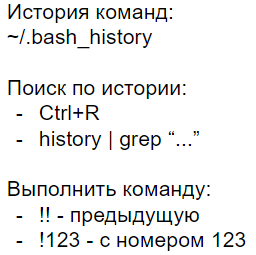
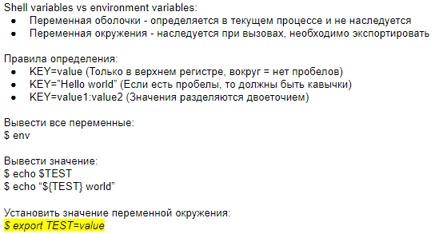
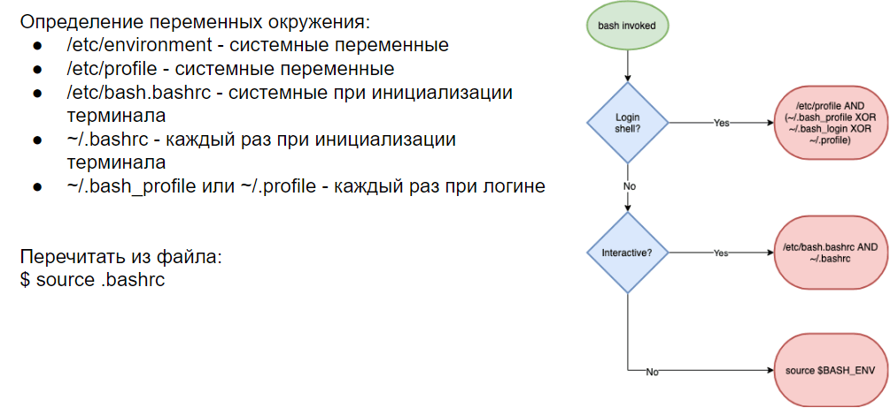
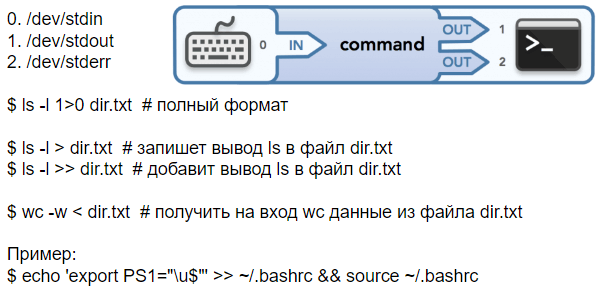

# 3 История команд, переменные окружения. Операторы перенаправления ввода-вывода и условного выполнения (; & ||)

*История команд*



*Переменные окружения*





*Потоки ввода-вывода и перенаправление*



*Операторы условного выполнения*

- `;` - используется для последовательного выполнения команд независимо от результата завершения предыдущей команды

```bash
command1; command2; command3
```

- `&` - используется для запуска команды в фоновом режиме (позволяет продолжить выполнение следующей команды без ожидания завершения предыдущей)

```bash
command1 & command2
```

- `&&` - используется для выполнения второй команды только в случае успешного завершения первой (возвращается статус 0)

```bash
command1 && command2
```

- `||` - используется для выполнения второй команды только в случае неудачного завершения первой (возвращает статус не 0)

```bash
command1 || command2
```

- Операторы можно комбинировать. Пример:

```bash
sleep 10 & echo "This will print is immediately"
```