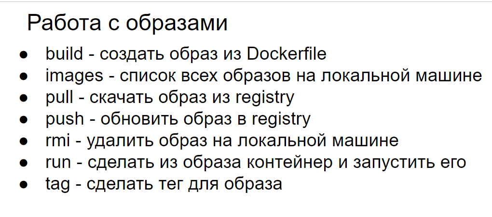
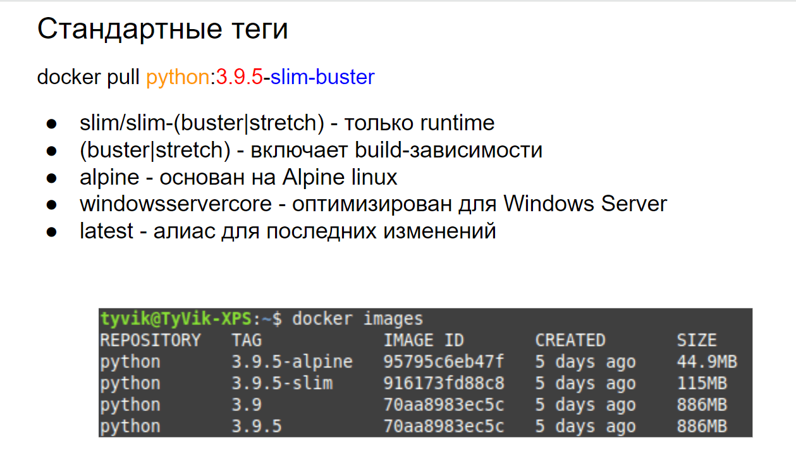

# 30 Работа с Docker образом. Различие образов alpine/slim/buster

## Работа с Docker образом



## Различие образов alpine/slim/buster



## **1. Alpine**

**Alpine Linux — это легковесная дистрибуция Linux, основанная на musl libc и busybox. Образ Alpine известен своей минималистичностью и малым размером.**

### Размер:

**Образ Alpine очень компактный, обычно занимает менее 10 МБ.**

### **Преимущества**:

- **Малый размер образа позволяет быстрее загружать и развертывать контейнеры.**
- **Минимальное количество установленных пакетов снижает поверхность атаки и улучшает безопасность.**
- **Хорошо подходит для микросервисов и контейнеров, где важна минимизация размера.**

### **Недостатки**:

- **Поскольку Alpine использует musl libc вместо glibc, могут возникнуть проблемы совместимости с некоторыми приложениями и библиотеками.**
- **Требуется больше усилий для настройки и установки дополнительных пакетов.**

### **Пример использования**:

**Используется для создания легковесных контейнеров, где важна минимизация размера и безопасность.**

```bash
FROM alpine:latest
```

## **2. Slim**

**Slim-образы представляют собой уменьшенные версии стандартных базовых образов, таких как Debian или Ubuntu, с удалением ненужных компонентов и пакетов.**

### Размер:

**Slim-образы значительно меньше своих полноценных аналогов, но обычно больше, чем Alpine.**

### **Преимущества**:

- **Уменьшенный размер по сравнению с полными образами позволяет быстрее загружать и развертывать контейнеры.**
- **Сохраняется совместимость с большинством приложений и библиотек, так как используется стандартная glibc.**

### **Недостатки**:

- **Все еще больше по размеру, чем Alpine.**
- **Может потребоваться установка дополнительных пакетов для некоторых приложений.**

### **Пример использования**:

**Используется для создания контейнеров, где важен баланс между размером и совместимостью.**

```bash
FROM python:3.9-slim
```

## **3. Buster**

**Buster — это кодовое имя для версии Debian 10. Образ Buster представляет собой полную версию дистрибуции Debian.**

### Размер:

**Образ Buster значительно больше, чем Alpine и Slim, так как включает больше предустановленных пакетов и компонентов.**

### **Преимущества**:

- **Полная совместимость с приложениями и библиотеками, так как используется стандартная glibc и полный набор пакетов Debian.**
- **Удобство использования и настройки благодаря наличию большого количества предустановленных утилит и библиотек.**

### **Недостатки**:

- **Большой размер образа увеличивает время загрузки и развертывания контейнеров.**
- **Больше установленных пакетов увеличивает поверхность атаки и может снизить безопасность.**

### **Пример использования**:

**Используется для создания контейнеров, где важна полная совместимость и удобство использования, и размер образа не является критичным фактором.**

```bash
FROM debian:buster
```

---

**Выбор между образами Alpine, Slim и Buster зависит от конкретных требований вашего проекта:**

**Alpine: Подходит для легковесных контейнеров, где важна минимизация размера и улучшенная безопасность.Slim: Хороший выбор для случаев, когда важен баланс между размером и совместимостью.Buster: Идеален для контейнеров, где важна полная совместимость и удобство использования, и размер образа не является критичным фактором.**

**Понимание этих различий поможет вам выбрать наиболее подходящий базовый образ для ваших контейнеров.**