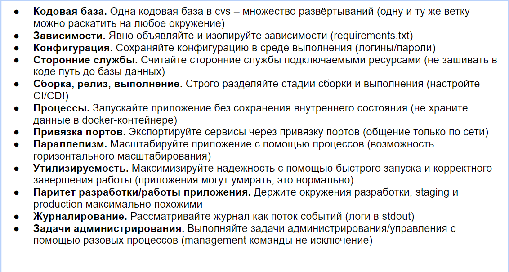

# 35 Оркестрация контейнеров 12-факторное приложение

**Оркестрация** контейнеров – это автоматическое управление жизненным циклом контейнеров, используемых для развертывания приложений.

**Развертывание**: Автоматическое размещение контейнеров с приложениями на серверах.

**Масштабирование**: Автоматическое добавление или удаление контейнеров в зависимости от нагрузки на приложение.

**Управление сетью**: Установление сетевых связей между контейнерами и управление внешним доступом к сервисам.

**Мониторинг**: Слежение за состоянием и производительностью контейнеров и приложений в них.

**Восстановление**: Автоматическое замещение контейнеров, которые перестали работать или начали работать некорректно.

**Распределение**: Распределение нагрузки и ресурсов между контейнерами и хостами.

**Kubernetes** является одной из самых популярных систем для оркестрации, который предлагает средства абстракции над пулами ресурсов и мощный набор API для управления контейнерами. В Kubernetes вы определяете желаемое состояние вашего приложения, и он автоматически управляет ресурсами для достижения и поддержки этого состояния.

Оркестрация контейнеров также облегчает процессы непрерывной интеграции (CI) и непрерывной доставки (CD), упрощает миграцию приложений между разными средами и обеспечивает консистентность развертывания. Рассмотрим дополнительные аспекты оркестрации контейнеров и преимущества, которые она предоставляет.

## 12 факторное приложение

