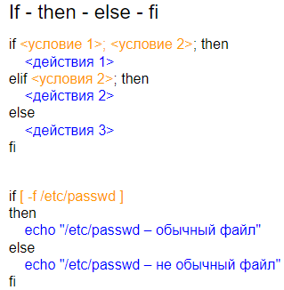
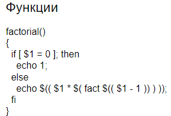

# 4 Синтаксис bash: строки, раскрытие выражений, проверки; операторы if, for, case, function; shebang

*Строки*


*Раскрытие выражений*

Раскрытие выражений - процесс замены специальных символов или конструкций их значениями перед выполнением команды:

- Раскрытие переменных

```bash
NAME="John"
echo "Hello, $NAME"
```

- Командная подстановка

```bash
DATE=$(date)
echo "Current date and time: $DATE"
```

- Арифметическая подстановка

```bash
echo $((3 + 5))
```

- Расширение путей

```bash
* - соответствует любому количеству любых символов
? - соответствует одному любому символу
[abc] - соответствует одному из символов a, b или c
{a,b} - соответствует строке a или b
Пример:
ls *.txt
```

- Расширение фигурных скобок

```bash
echo {A,B,C}file
Вывод: Afile Bfile Cfile
```

- Подстановка тильды

```bash
echo ~
~ используется для обозначения домашней директории пользователя
```

*Проверки*


*Операторы и циклы*






*SheBang*


SheBang - специальная последовательность символов, которая используется в скриптах Unix и Unix-подобных систем для указания интерпретатора, который должен быть использован для выполнения скрипта

```bash
#!/path/to/interpreter
Пример:
#!/bin/bash
echo "Hello, Bash!"
```