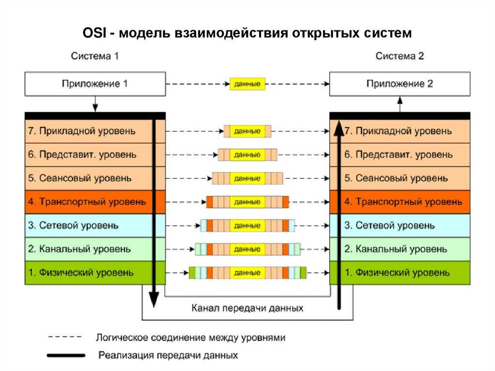

# 43 Протокол HTTP/1.1 (опционально HTTP/2.0, HTTP/3.0). Модель OSI/ISO

## **43. Протокол HTTP/1.1 (опционально HTTP/2.0, HTTP/3.0). Модель OSI/ISO**

**HTTP (Hypertext Transfer Protocol)** — это протокол передачи гипертекста, используемый для обмена информацией между клиентом и сервером в сети интернет.

**HTTP/1.1** стал стандартом в 1997 году и внёс несколько значительных улучшений в сравнении с HTTP/1.0, таких как поддержка постоянных соединений (persistent connections), что позволило снизить нагрузку на сеть.

**HTTP/2.0** был опубликован в 2015 году. Некоторые из его ключевых улучшений включают мультиплексирование (когда несколько запросов могут быть отправлены через одно соединение без ожидания ответа), поддержку приоритетов и зависимостей между запросами, и начальное сжатие заголовков.

**HTTP/3.0,** также известный как HTTP-over-QUIC, находится на этапе разработки. Он предлагает передачу данных через протокол QUIC вместо TCP. QUIC позволяет устанавливать соединение с минимальной задержкой и лучше справляется с потерей пакетов данных.

**Модель OSI (Open Systems Interconnection)** — это концептуальная модель, которая описывает, как различные сетевые протоколы взаимодействуют и обмениваются данными.

**Состоит из семи слоёв:**

- **Физический слой:** направлен на передачу и приём неструктурированных данных по физической среде.
- **Канальный слой**: обеспечивает ошибкобезопасную передачу данных.
- **Сетевой слой**: отвечает за маршрутизацию данных.
- **Транспортный слой**: обеспечивает надёжность передачи данных.
- **Сеансовый слой**: управляет созданием и уничтожением сессий.
- **Представления**: преобразует данные в формат, удобный для передачи.
- **Прикладной слой**: служит интерфейсом для работы с приложениями пользователя.

Модель **OSI** помогает понимать, как данные передаются от приложений пользователя к физической сетевой среде и обратно.

---