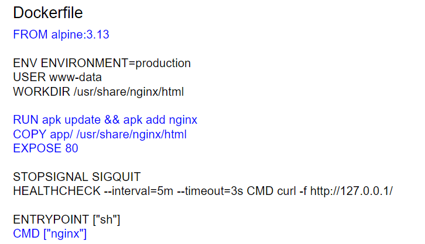
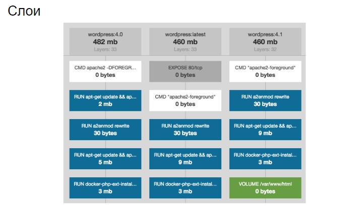
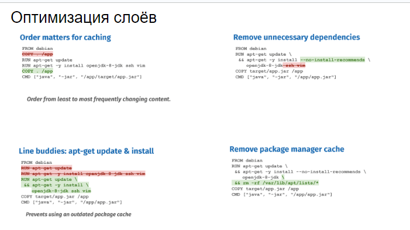
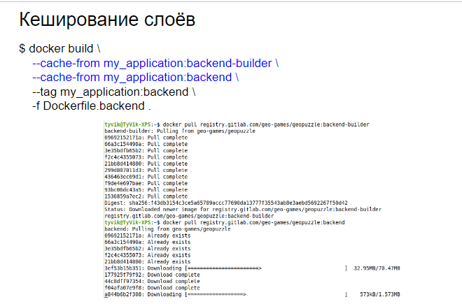
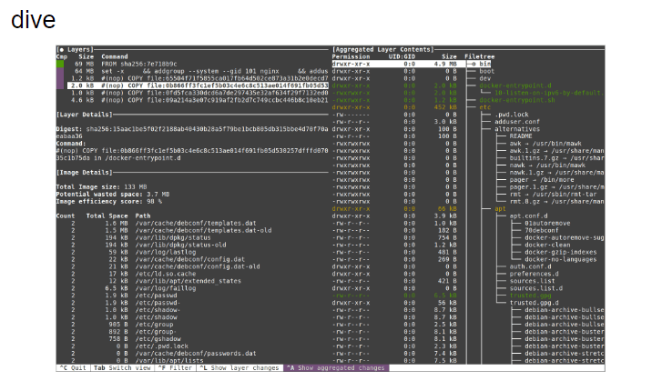

# 44  Dockerfile. Методы оптимизации слоёв.

## 44.  Dockerfile. Методы оптимизации слоёв

**Dockerfile** — это текстовый документ, который содержит все команды, которые пользователь мог бы вызвать в командной строке для создания образа. Docker использует этот Dockerfile для создания Docker образов автоматически.

В Dockerfile предусмотрены различные команды, которые сигнализируют Docker о том, что нужно делать на каждом шаге процесса создания образа. 

К ним относятся:

- `FROM`: указывает базовый (родительский) образ.
- `RUN`: выполняет команду и создаёт новый слой образа.
- `CMD`: предоставляет значения по умолчанию, которые включают исполняемый файл, который будет запущен при создании контейнера.
- `EXPOSE`: информирует Docker, что контейнер слушает указанный сетевой порт во время выполнения.
- `WORKDIR`: устанавливает рабочий каталог для команд `RUN`, `CMD`, `ENTRYPOINT`, `COPY` и `ADD`.
- `ENV`: устанавливает неизменяемые переменные окружения.



### Адекватный вид докерфайла:

```docker
FROM alpine:3.13

ENV ENVIRONMENT=production
USER www-data
WORKDIR /usr/share/nginx/html

RUN apk update && apk add nginx
COPY app/ /usr/share/nginx/html
EXPOSE 80

STOPSIGNAL SIGQUIT
HEALTHCHECK --interval=5m --timeout=3s CMD curl -f http://127.0.0.1/

ENTRYPOINT ["sh"]
CMD ["nginx"]
```





- Порядок имеет значение для кэширования (упорядочивайте контент от наименее часто меняющегося к наиболее часто меняющемуся)
- Удаляем ненужные зависимости
- Удаляем кэш пакетного менеджера

Docker образы состоят из слоёв. Каждая команда в Dockerfile создаёт новый слой. Чем больше слоёв, тем больше размер образа. Оптимизация слоёв в Dockerfile занимает важное место. 

Ниже приведены некоторые методы оптимизации слоёв:

- **Минимизируйте количество слоёв:** объединяйте несколько команд `RUN` в одну, используя оператор `&&`. Такой подход называют multi-stage build.
- **Используйте базовый образ меньшего размера:** Например, вместо стандартного образа Ubuntu можно использовать образ Alpine Linux, который гораздо меньше по размеру.
- **Используйте .dockerignore:** Файл .dockerignore действует подобно .gitignore. Он указывает Docker игнорировать указанные файлы и директории при создании образа, что может сократить размер образа.
- **Удаляйте ненужные файлы в тех же слоях, что их создание:** Если вы создали временные файлы или установили пакеты только для одного pass в Dockerfile, то удалите их в том же слое.
- **Не сохраняйте большие файлы в кэше:** Для промежуточных слоёв эксплуатируйте опцию `--no-cache` в командах `apt-get` или `apk` (для Linux Alpine).

Соблюдение этих простых правил позволит существенно уменьшить размер создаваемых Docker образов и ускорить развёртывание контейнеров.





---