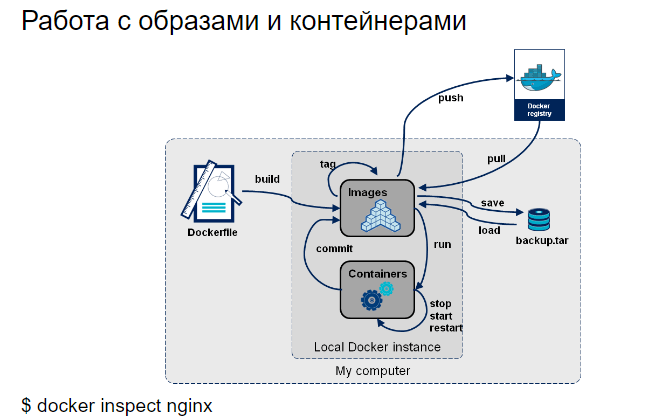
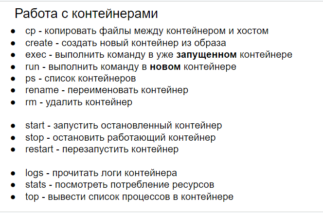

# 47 Работа с Docker образом. Различие образов alpine/slim/buster.

## 47. Работа с Docker образом. Различие образов alpine/slim/buster.

**Docker образ** — это read-only шаблон, который содержит файловую систему и параметры, которые используются для создания Docker контейнера. Образы создаются из Dockerfile с помощью команды `docker build`.

- Для получения списка всех доступных на локальной машине образов используйте команду `docker images`.
- Чтобы загрузить образ с Docker Hub, используйте команду `docker pull image_name`.
- Чтобы создать контейнер из образа, используйте команду `docker run image_name`.
- Для удаления неиспользуемых образов есть команда `docker image prune`.

- **Alpine:** Самый маленький по размеру. Alpine Linux — это независимый дистрибутив, ориентированный на безопасность и экономию ресурсов. Он широко используется для создания легковесных контейнеров Docker.
- **Slim:** Средний по размеру, используется когда нужны некоторые стандартные библиотеки Unix/Linux, которые отсутствуют в Alpine. Slim образы обычно используют Debian или Ubuntu дистрибутивы в качестве основы.
- **Buster:** Это кодовое название версии Debian 10. Debiain Buster образы обычно будут самыми большими по размеру, но при этом они предоставят наиболее широкий набор функций и библиотек, что бывает полезно для сложных приложений.

Выбор между этими образами зависит от ваших потребностей. Если вам нужен наименьший возможный размер образа и вы готовы управлять зависимостями вручную, выбирайте Alpine. Если вам нужно больше функций "из коробки", выберите Slim или Buster.

---