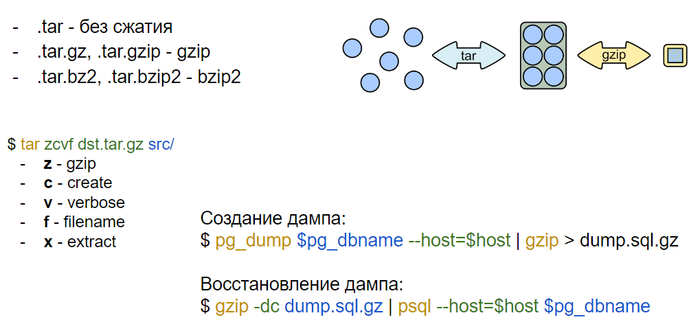
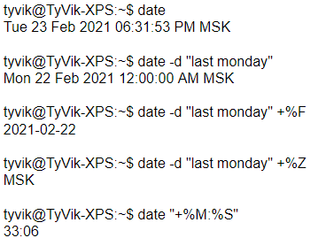

# 5 Работа с утилитами: архивация, cron, find, date, xargs, du/df

*Архивация*



*Cron*

```bash
crontab -e
0 2 * * * /bin/cp -r /home/user/data /home/user/backup

1-я строка - открытие файла crontab для редактирования
2-я строка - скрипт, который выполняет резервное копирование каталога
/home/user/data каждый день в 2 часа ночи и сохраняет в
/home/user/backup
```

*Find*

`find / -type f -name *.conf -user root -size +20k -newermt 2020-03-03 -exec ls -la {} \; 2>/dev/null` - выполняет поиск по следующий фильтрам: `-type f` - тип файлов; `-name *.conf` - любое имя с расширением `.conf`; `-user root` - владелец `root`; `-size +20k` - размер больше 20КБ; `-newermt 2020-03-03` - были созданы после 3 марта 2020; `-exec ls -la {} \;` - к каждому результату запроса применяет `la -ls`; `2>/dev/null` - перенаправляет ошибки из терминала (чтобы их не было видно)

*Date*



*Xargs*

Xargs - используется для выполнения команд с дополнительными аргументами, т.е. выполняет указанную команду и передаёт ей дополнительный аргумент

```bash
cat filelist.txt | xargs rm
эта команда читает файл и удаляет все перечисленные файлы

find . -name *.log | xargs rm
эта команда ищет и удаляет все файлы с расширением .log
```

*du/df*

du - используется для оценки использования дискового пространства файлами и каталогами

```bash
du - показывает использование дискового пространства для текущего
каталога и всех его подкаталогов

du -h - выводит информацию в более удобном формате

du -s - выводит только общий размер дискового пространства,
используемого каталогом

du -c - выводит общий размер дискового пространства для всех
перечисленных файлов и каталогов

du -a - включает файлы в вывод (по умолчанию выводит только каталоги)
```

df - используется для отображения информации о свободном и занятом дисковом пространстве на файловых системах

```bash
df - показывает информацию о файловых системах

df -h - выводит информацию в более удобном формате

df -T - показывает тип файловой системы

df -i - показывает использование инодов вместо блоков диска
```