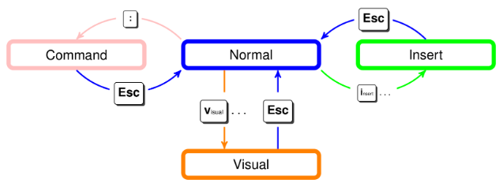

# 6 Работа с текстом: vim, grep, sed, less/more, man

*Vim*

Vim - мощный (и крайне неудобный) текстовый редактор

(Ubuntu) `sudo apt install vim` / `sudo pacman -S vim` (Arch) - установка

`vim` - открыть редактор

`vim file.txt` - открыть конкретный файл

У Vim`a есть несколько режимов работы (очень удобно и не запутаешься)



Нормальный - запускается по умолчанию, Командный - для ввода различных команд, Вставка - для манипуляций с текстом, Визуальный - для навигации по документу

Основные команды и горячие клавиши:

```bash
Выйти с сохранением:
:wq
Выйти без сохранения:
:q!

Режим работы (вставка):
i - вставка перед курсором
a - вставка после курсора

Перемещение (визуальный):
h - влево
j - вниз
k - вверх
l - вправо
gg - в начало файла
G - в конец файла
0 - в начало строки
$ - в конец строки
(впринципе, всё очень логично и понятно, верно?)
```

*Grep*

Grep - утилита для поиска шаблонов в файлах

`grep “pattern” filename` - общий вид конструкций поиска

Примеры и ключи:

`grep  “pattern” *` - ищет строки с шаблоном во всех файлах текущей директории

`grep -r “pattern” .` - рекурсивно ищет строки с шаблоном во всех файлах и поддерикториях текущей директории

`grep -i “pattern” test.txt` - ищет строки с шаблоном игнорируя регистр

`grep -n “pattern” test.txt` - покажет строки, содержащие шаблон, вместе с номерами строк

`grep -w “pattern” test.txt` - ищет строки, которые содержат точное совпадение шаблона

`grep -v “pattern” test.txt` - ищет строки, которые не содержат шаблон

*Sed*

Sed - утилита для обработки текстовых данных

`sed ‘s/old_text/new_text/’ file.txt` - заменяет первое вхождение `old_text` на `new_text` в каждой строке

`sed ‘s/old_text/new_text/g’ file.txt` - заменяет все вхождения `old_text` на `new_text` в каждой строке

`sed ‘s/old_text/new_text/I’ file.txt` - заменяет все вхождения `old_text` на `new_text`, игнорируя регистр

`sed ‘3d’ file.txt` - удаляет третью строку из файла `file.txt`

`sed ‘/pattern/d’ file.txt` - удаляет все строки с шаблоном из файла `file.txt`

`sed ‘3i\New line’ file.txt` - добавляет строку `New line` перед третьей строки в файл `file.txt`

`sed ‘3a\New line’ file.txt` - добавляет строку `New line` после третьей строки в файл `file.txt`

*Less/More*

more позволяет просматривать содержимое файла постранично

`more file.txt` - открытие файла

Основные клавиши управления:

- space - пролистать на одну страницу вниз
- enter - пролистать на одну страницу вверх
- b - пролистать на одну строку вверх
- q - выйти из просмотра
- /pattern - найти шаблон
- n - переход к следующему вхождению шаблона

less является более крутой версией more

`less file.txt` - открытие файла

Основные клавиши управления:

- space - пролистать на одну страницу вниз
- enter - пролистать на одну страницу вверх
- b - пролистать на одну строку вверх
- u - пролистать на полстраницы вверх
- d - пролистать на полстраницы вниз
- g - перейти в начало файла
- G - перейти в конец файла
- q - выйти из просмотра
- /pattern - найти строки с шаблоном
- n - перейти к следующему вхождению текста
- N - перейти в предыдущему вхождению текста
- ?pattern - искать строки с шаблонами в обратном порядке
- %pattern - показать только строки с шаблоном
- F - следить за изменениями в файле

*Man*

Man - команда для вызова мануала для команды

Пример: `man ls` - справка команды `ls`