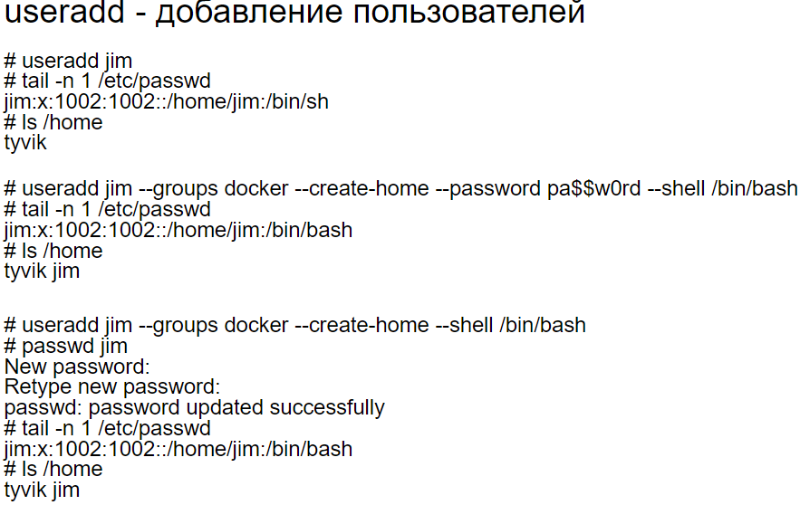
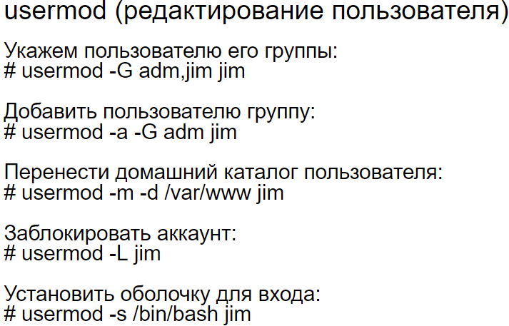
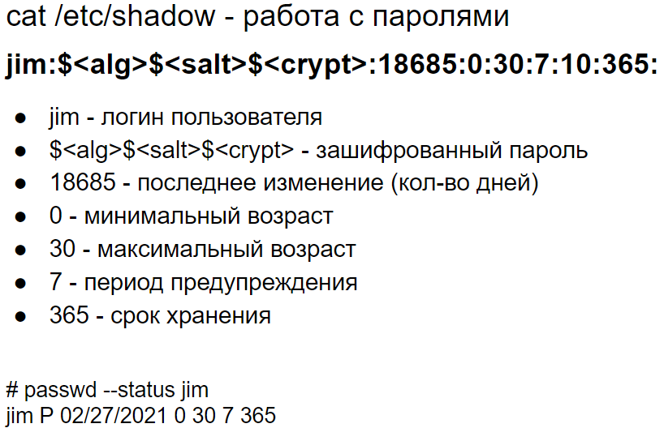
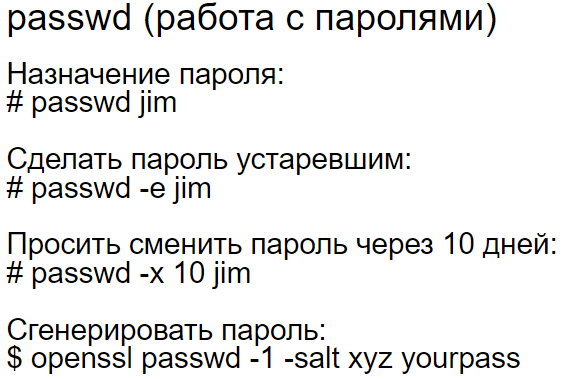
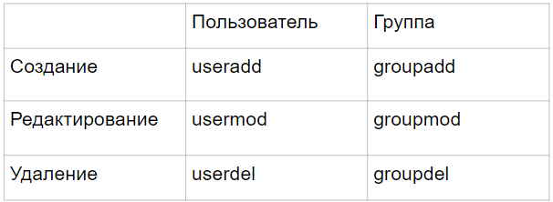

# 7 Работа с пользователями: добавление, редактирование, удаление. Работа с паролями

*Работа с пользователями (основные моменты для дальнейшего написании команд)*

*Добавление пользователя*

*Редактирование пользователя*

*Удаление пользователя*

*Работа с паролями*

*Системные группы и управление ими*

