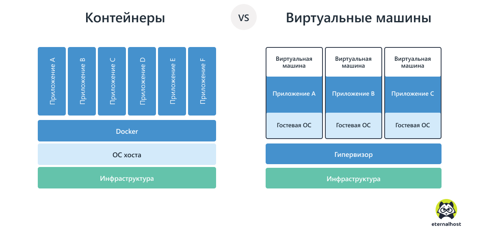
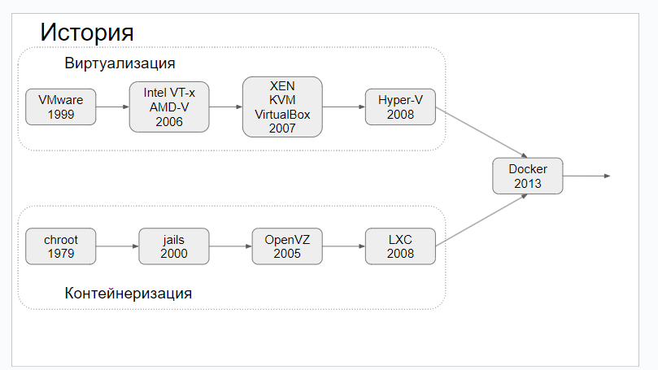
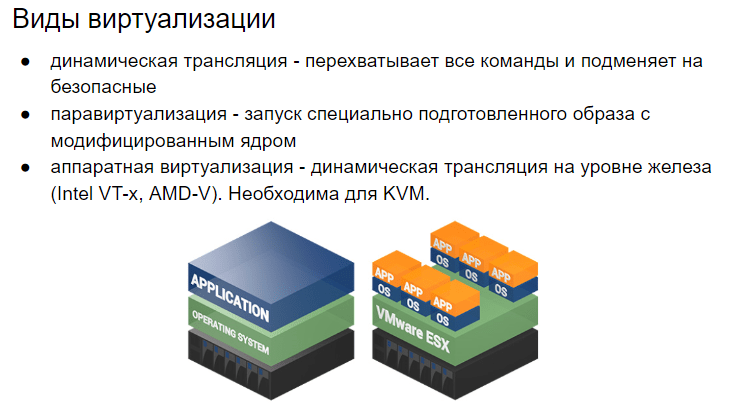
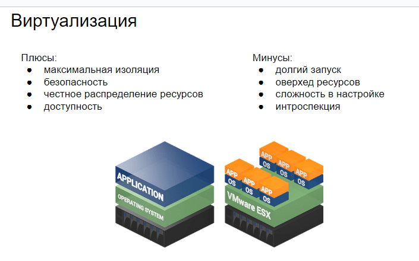
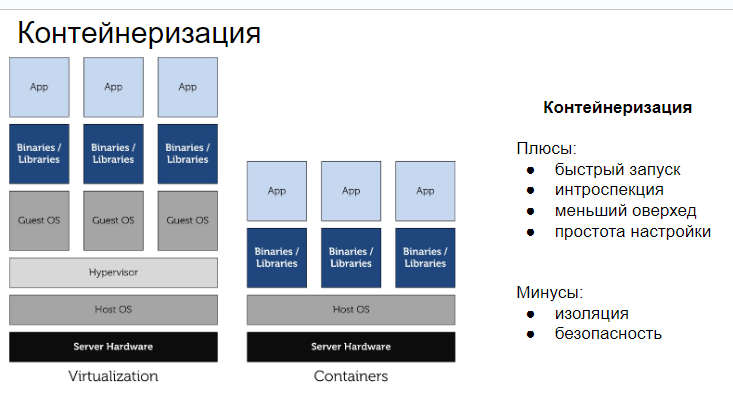
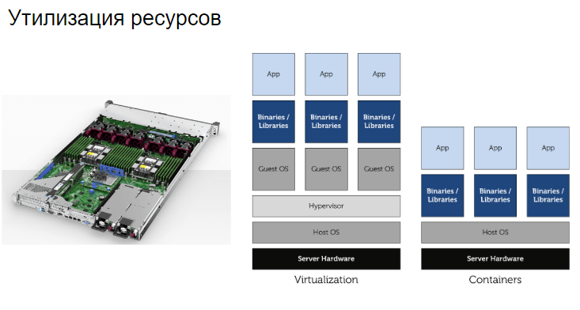

# КОНТЕЙНЕРИЗАЦИЯ И ВИРТУАЛИЗАЦИЯ

# КОНТЕЙНЕРИЗАЦИЯ И ВИРТУАЛИЗАЦИЯ

**Так в чём же отличие Docker-контейнеров от VM?**

***Виртуальная машина (VM)*** — это виртуальный компьютер со всеми виртуальными устройствами и виртуальным жёстким диском, на который и устанавливается новая независимая ОС (гостевая ОС) вместе с виртуальными драйверами устройств, управлением памятью и другими компонентами. Т. е. мы получаем абстракцию физического оборудования, позволяющую запускать на одном компьютере множество виртуальных компьютеров. Виртуальное оборудование отображается в свойствах системы, а установленные приложения взаимодействуют с ним как с настоящим. При этом сама виртуальная машина полностью изолирована от реального компьютера, хотя и может иметь доступ к его диску и периферийным устройствам.

***Установленная VM может по-разному занимать место на диске компьютера:***

- фиксированное место на жёстком диске, что позволяет осуществлять более быстрый доступ к виртуальному жёсткому диску и позволяет избежать фрагментации файла;
- динамическое выделение памяти. При установке дополнительных приложений память будет динамически выделяться под них, пока не достигнет максимального объема, отведенного ей.

При использовании VM появляются дополнительные расходы на эмуляцию виртуального оборудования и запуск гостевой ОС, поддержка и администрирование необходимого окружения для работы вашего приложения. Также при разворачивании большого количества виртуальных машин на сервере объем занимаемого ими места на жёстком диске будет только расти, т.к. для каждой VM требуется место, как минимум, для гостевой ОС и драйверов для виртуальных устройств.

***Docker*** — это ПО для создания приложений на основе контейнеров. Контейнеры и виртуальные машины решают одну задачу, но делают это по-разному. Контейнеры занимают меньше места, т.к. переиспользуют большее количество общих ресурсов хост-системы чем VM, т.к. в отличие от VM, обеспечивает виртуализацию на уровне ОС, а не аппаратного обеспечение. Такой подход обеспечивает меньший объем занимаемого места на жёстком диске, быстрое развертывание и более простое масштабирование.

Docker-контейнер даёт более эффективный механизм инкапсуляции приложений, обеспечивая необходимые интерфейсы хост-системы. Данная возможность позволяет контейнерам разделить ядро системы, где каждый из контейнеров работает как отдельный процесс основной ОС, у которого есть своё собственное виртуальное адресное пространство, таким образом данные, принадлежащие разным областям памяти, не могут быть изменены.

Docker наиболее распространенная технология использования контейнеров в работе приложения. Он стал стандартом в этой области, строясь на основе cgroups и пространстве имён, которые обеспечивает ядро Linux. Нативной ОС для Docker является Linux, поэтому запуск Docker-контейнеров на Windows будет происходить внутри виртуальной машины с ОС Linux.

**Из чего создаётся контейнер?**

***Образ*** — основной элемент, из которого создаются контейнеры. Образ создаётся из Dockerfile, добавленного в проект и представляет собой набор файловых систем (слоёв) наслоённых друг на друга и сгруппированных вместе, доступных только для чтения; максимальное число слоёв равно 127.

В основе каждого образа находится базовый образ, который указывается командой FROM — входная точка при формировании образа Dockerfile. Каждый слой является readonly-слоем и представлен одной командой, модифицирующей файловую систему, записанной в Dockerfile. Данный подход позволяют разным файлам и директориям из разных файловых слоёв прозрачно накладываться, создавая каскадно-объединённую файловую систему. Слои содержат метаданные, позволяющие сохранять сопутствующую информацию о каждом слое во время выполнения и сборки. Каждый слой содержит ссылку на следующий слой, если слой не имеет ссылки, значит это самый верхний слой в образе.

Начиная с версии Docker EE 17.06.02-ee5 и в Docker Engine — Community используется Overlay2 или Overlay, в более ранних версиях используется AuFS (Advanced multi layered Union file system).

**Контейнер — как это работает?**

***Контейнер*** — это абстракция на уровне приложения, объединяющая код и зависимости. Контейнеры всегда создаются из образов, добавляя доступный для записи верхний слой и инициализирует различные параметры. Т. к. контейнер имеет свой собственный слой для записи и все изменения сохраняются в этом слое, несколько контейнеров могут совместно использовать доступ к одному и тому же образу. Каждый контейнер можно настроить через файл в проекте docker-compose.yml, задавая различные параметры, такие как имя контейнера, порты, идентификаторы, зависимости между другими контейнерами. Если в настройках не задавать имя контейнера, то Docker каждый раз будет создавать новый контейнер, присваивая ему имя случайным образом.

Когда контейнер запускается из образа, Docker монтирует файловую систему для чтения и записи поверх любых слоев ниже. Именно здесь будут выполняться все процессы. При первом запуске контейнера начальный слой чтения-записи пуст. Когда происходят изменения, они применяются к этому слою; например, если вы хотите изменить файл, этот файл будет скопирован из нижнего слоя только для чтения в слой для чтения и записи. Версия файла, доступная только для чтения, все еще будет существовать, но теперь она скрыта под копией.

**Как работает каскадно-объединённая файловая система?**

Каскадно-объединённая файловая система (ФС) реализует механизм копирования при записи (Copy-On-Write, COW). Рабочей единицей является слой, каждый слой следует рассматривать как отдельную полноценную файловую систему с иерархией директорий от самого корня. Данный подход использует объединенное монтирование файловых систем, позволяя, прозрачно для пользователя, объединять файлы и каталоги различных файловых систем (называемых ветвями) в единую связанную файловую систему. Содержимое каталогов с одинаковыми путями будет отображаться вместе в одном объединенном каталоге (в едином пространстве имён) полученной файловой системы.

***Объединение слоёв происходит по следующим принципам:***

- один из слоёв становится слоем верхнего уровня, второй и последующие – слоями нижнего уровня;
- пользователю объекты слоёв доступны «сверху вниз», т.е. если запрошенный объект есть в «верхнем» слое, возвращается он, независимо от наличия объекта с таким именем в «нижнем» слое; иначе возвращается объект «нижнего» слоя; если запрошенного объекта нет ни там, ни там, возвращается ошибка «Нет такого файла или каталога»;
- рабочим слоем является «верхний», то есть все действия пользователя по изменению данных отражаются только на слое верхнего уровня, не влияя на содержимое слоёв нижних уровней.

**Вывод**

При необходимости виртуализации системы с гарантированно выделенными ресурсами и виртуальным аппаратным обеспечение, стоит выбрать VM. Что даёт использование VM:

- возможность установки на одном компьютере нескольких различных ОС;
- распределение системных ресурсов между виртуальными машинами;
- отсутствие необходимости перезагрузки для переключения между операционными системами;
- возможность сделать «снимок» текущего состояния системы и содержимого дисков для возвращения системы в исходное состояние;
- изоляция неисправностей и нарушений системы безопасности на аппаратном уровне;
- возможность моделирования вычислительной сети на одном компьютере.

Если вы хотите изолировать работающие приложения как отдельные процессы, вам подойдёт Docker. Что даёт использование Docker:

- обеспечивает виртуализацию на уровне ОС;
- контейнеры разделяют ядро системы, работая как отдельный процесс основной ОС;
- потребление системных ресурсов, таких как расход памяти и нагрузка на CPU, могут ограничиваться отдельно для каждого контейнера с использованием cgroups;
- ФС для контейнеров создаётся с использованием механизма COW, что позволяет ускорить разворачивание приложения, снижает расход памяти и экономит место на диске;
- изменённая файловая система одного контейнера, может использоваться в качестве основы для формирования новых базовых образов других контейнеров.