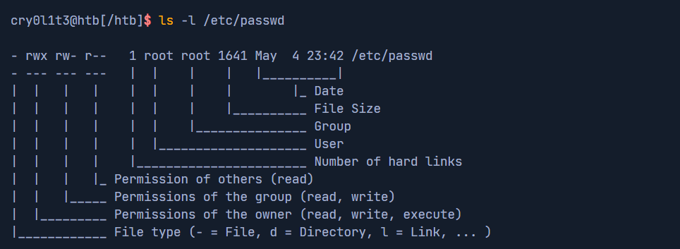
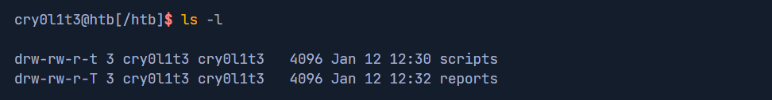

# Управление разрешениями

Существует 3 правила для доступа различного рода:

- `execute`, сокращённо `(x)` - нужно для того, чтобы пользователь мог посетить каталог и просмотреть содержимое, а также запустить файл (иначе появится предупреждение `Permission Denied`)
- `read`, сокращённо `(r)` - нужно для того, чтобы пользователь мог читать файлы
- `write`, сокращённо `(w)` - нужно для того, чтобы можно было изменять содержимое каталога (создавать, удалять, переименовывать файлы)

`chmod пользователи/команда_добавить_или_удалить/права файл/каталог` - позволяет изменять права у пользователей для доступа к конкретным файлам/каталогам

Теги для пользователей:

- `u` - владелец
- `g` - группа
- `o` - другие
- `a` - все пользователи

Операции:

- `+` - добавляет права
- `-` - удаляет права

Права используются в сокращённом виде (будет понятно в примере)

- `chmod a+r shell` - добавляет права на чтение оболочки `shell` всем пользователям
- `chmod 754 shell` - аналог прошлой команды через восьмеричное значение

`chown пользователь:группа файл/директория` - позволяет изменять владельцев и/или групповые значения файлов/каталогов

- `chown root:root shell` - ставит владельца и группу `root` для оболочки `shell`

Администраторы могут устанавливать фиксированный бит для каталогов/файлов для того, чтобы другие пользователи, у которых есть доступ к этому файлу/каталогу, не могли его изменять/удалять/перемещать, так как это важно для других пользователей

Такой бит выглядит как `t` или `Т` (для `t` разрешено `execute`, а для `Т` - нет)

