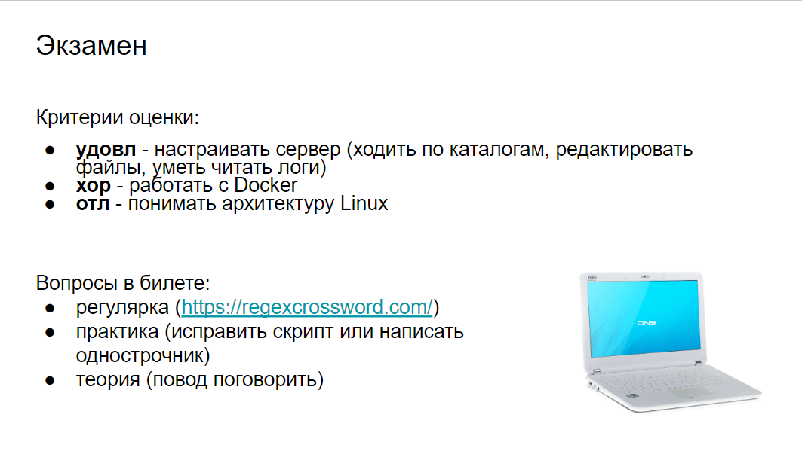

# Linux

Краткий конспект моих лекций. Составлен студентами при подготовке к экзамену.

[Слайды лекций](https://drive.google.com/drive/folders/1HFwBXahYd_JqMLSBxxLSnkI0926ERTrQ?usp=sharing)

***Ссылки на отдельные части***

[Вызов справки](Linux/%D0%92%D1%8B%D0%B7%D0%BE%D0%B2%20%D1%81%D0%BF%D1%80%D0%B0%D0%B2%D0%BA%D0%B8.md)

[Информация о системе](Linux/%D0%98%D0%BD%D1%84%D0%BE%D1%80%D0%BC%D0%B0%D1%86%D0%B8%D1%8F%20%D0%BE%20%D1%81%D0%B8%D1%81%D1%82%D0%B5%D0%BC%D0%B5.md)

[Навигация](Linux/%D0%9D%D0%B0%D0%B2%D0%B8%D0%B3%D0%B0%D1%86%D0%B8%D1%8F.md)

[Работа с файлами и каталогами](Linux/%D0%A0%D0%B0%D0%B1%D0%BE%D1%82%D0%B0%20%D1%81%20%D1%84%D0%B0%D0%B8%CC%86%D0%BB%D0%B0%D0%BC%D0%B8%20%D0%B8%20%D0%BA%D0%B0%D1%82%D0%B0%D0%BB%D0%BE%D0%B3%D0%B0%D0%BC%D0%B8.md)

[Редактирование файлов](Linux/%D0%A0%D0%B5%D0%B4%D0%B0%D0%BA%D1%82%D0%B8%D1%80%D0%BE%D0%B2%D0%B0%D0%BD%D0%B8%D0%B5%20%D1%84%D0%B0%D0%B8%CC%86%D0%BB%D0%BE%D0%B2.md)

[Поиск файлов и каталогов](Linux/%D0%9F%D0%BE%D0%B8%D1%81%D0%BA%20%D1%84%D0%B0%D0%B8%CC%86%D0%BB%D0%BE%D0%B2%20%D0%B8%20%D0%BA%D0%B0%D1%82%D0%B0%D0%BB%D0%BE%D0%B3%D0%BE%D0%B2.md)

[Файловые дескрипторы и перенаправления](Linux/%D0%A4%D0%B0%D0%B8%CC%86%D0%BB%D0%BE%D0%B2%D1%8B%D0%B5%20%D0%B4%D0%B5%D1%81%D0%BA%D1%80%D0%B8%D0%BF%D1%82%D0%BE%D1%80%D1%8B%20%D0%B8%20%D0%BF%D0%B5%D1%80%D0%B5%D0%BD%D0%B0%D0%BF%D1%80%D0%B0%D0%B2%D0%BB%D0%B5%D0%BD%D0%B8%D1%8F.md)

[Фильтрация контента](Linux/%D0%A4%D0%B8%D0%BB%D1%8C%D1%82%D1%80%D0%B0%D1%86%D0%B8%D1%8F%20%D0%BA%D0%BE%D0%BD%D1%82%D0%B5%D0%BD%D1%82%D0%B0.md)

[Регулярные выражения](Linux/%D0%A0%D0%B5%D0%B3%D1%83%D0%BB%D1%8F%D1%80%D0%BD%D1%8B%D0%B5%20%D0%B2%D1%8B%D1%80%D0%B0%D0%B6%D0%B5%D0%BD%D0%B8%D1%8F.md)

[Управление разрешениями](Linux/%D0%A3%D0%BF%D1%80%D0%B0%D0%B2%D0%BB%D0%B5%D0%BD%D0%B8%D0%B5%20%D1%80%D0%B0%D0%B7%D1%80%D0%B5%D1%88%D0%B5%D0%BD%D0%B8%D1%8F%D0%BC%D0%B8.md)

[Управление пользователями](Linux/%D0%A3%D0%BF%D1%80%D0%B0%D0%B2%D0%BB%D0%B5%D0%BD%D0%B8%D0%B5%20%D0%BF%D0%BE%D0%BB%D1%8C%D0%B7%D0%BE%D0%B2%D0%B0%D1%82%D0%B5%D0%BB%D1%8F%D0%BC%D0%B8.md)

[Управление пакетами](Linux/%D0%A3%D0%BF%D1%80%D0%B0%D0%B2%D0%BB%D0%B5%D0%BD%D0%B8%D0%B5%20%D0%BF%D0%B0%D0%BA%D0%B5%D1%82%D0%B0%D0%BC%D0%B8.md)

[Управление сервисами и процессами](Linux/%D0%A3%D0%BF%D1%80%D0%B0%D0%B2%D0%BB%D0%B5%D0%BD%D0%B8%D0%B5%20%D1%81%D0%B5%D1%80%D0%B2%D0%B8%D1%81%D0%B0%D0%BC%D0%B8%20%D0%B8%20%D0%BF%D1%80%D0%BE%D1%86%D0%B5%D1%81%D1%81%D0%B0%D0%BC%D0%B8.md)

[Планирование задач](Linux/%D0%9F%D0%BB%D0%B0%D0%BD%D0%B8%D1%80%D0%BE%D0%B2%D0%B0%D0%BD%D0%B8%D0%B5%20%D0%B7%D0%B0%D0%B4%D0%B0%D1%87.md)

[Сетевые сервисы](Linux/%D0%A1%D0%B5%D1%82%D0%B5%D0%B2%D1%8B%D0%B5%20%D1%81%D0%B5%D1%80%D0%B2%D0%B8%D1%81%D1%8B.md)

[Работа с веб-сервисами](Linux/%D0%A0%D0%B0%D0%B1%D0%BE%D1%82%D0%B0%20%D1%81%20%D0%B2%D0%B5%D0%B1-%D1%81%D0%B5%D1%80%D0%B2%D0%B8%D1%81%D0%B0%D0%BC%D0%B8.md)

[Резервное копирование и восстановление](Linux/%D0%A0%D0%B5%D0%B7%D0%B5%D1%80%D0%B2%D0%BD%D0%BE%D0%B5%20%D0%BA%D0%BE%D0%BF%D0%B8%D1%80%D0%BE%D0%B2%D0%B0%D0%BD%D0%B8%D0%B5%20%D0%B8%20%D0%B2%D0%BE%D1%81%D1%81%D1%82%D0%B0%D0%BD%D0%BE%D0%B2%D0%BB%D0%B5%D0%BD%D0%B8%D0%B5.md)

[Управление файловой системой](Linux/%D0%A3%D0%BF%D1%80%D0%B0%D0%B2%D0%BB%D0%B5%D0%BD%D0%B8%D0%B5%20%D1%84%D0%B0%D0%B8%CC%86%D0%BB%D0%BE%D0%B2%D0%BE%D0%B8%CC%86%20%D1%81%D0%B8%D1%81%D1%82%D0%B5%D0%BC%D0%BE%D0%B8%CC%86.md)

[Контейнеризация](Linux/%D0%9A%D0%BE%D0%BD%D1%82%D0%B5%D0%B8%CC%86%D0%BD%D0%B5%D1%80%D0%B8%D0%B7%D0%B0%D1%86%D0%B8%D1%8F.md)

[Настройка сети](Linux/%D0%9D%D0%B0%D1%81%D1%82%D1%80%D0%BE%D0%B8%CC%86%D0%BA%D0%B0%20%D1%81%D0%B5%D1%82%D0%B8.md)

[Протоколы удалённого рабочего стола](Linux/%D0%9F%D1%80%D0%BE%D1%82%D0%BE%D0%BA%D0%BE%D0%BB%D1%8B%20%D1%83%D0%B4%D0%B0%D0%BB%D0%B5%CC%88%D0%BD%D0%BD%D0%BE%D0%B3%D0%BE%20%D1%80%D0%B0%D0%B1%D0%BE%D1%87%D0%B5%D0%B3%D0%BE%20%D1%81%D1%82%D0%BE%D0%BB%D0%B0.md)

[Безопасность Linux](Linux/%D0%91%D0%B5%D0%B7%D0%BE%D0%BF%D0%B0%D1%81%D0%BD%D0%BE%D1%81%D1%82%D1%8C%20Linux.md)

[Настройка брандмауэра](Linux/%D0%9D%D0%B0%D1%81%D1%82%D1%80%D0%BE%D0%B8%CC%86%D0%BA%D0%B0%20%D0%B1%D1%80%D0%B0%D0%BD%D0%B4%D0%BC%D0%B0%D1%83%D1%8D%D1%80%D0%B0.md)

[Системные журналы и мониторинг](Linux/%D0%A1%D0%B8%D1%81%D1%82%D0%B5%D0%BC%D0%BD%D1%8B%D0%B5%20%D0%B6%D1%83%D1%80%D0%BD%D0%B0%D0%BB%D1%8B%20%D0%B8%20%D0%BC%D0%BE%D0%BD%D0%B8%D1%82%D0%BE%D1%80%D0%B8%D0%BD%D0%B3.md)

[Solaris](Linux/Solaris.md)

[Горячие клавиши](Linux/%D0%93%D0%BE%D1%80%D1%8F%D1%87%D0%B8%D0%B5%20%D0%BA%D0%BB%D0%B0%D0%B2%D0%B8%D1%88%D0%B8.md)

---

# Билеты к экзамену

# Ссылки на отдельные вопросы

[1 История GNU/Linux, концепции и стандарты POSIX. Основные компоненты Linux и различия в дистрибутивах](Linux/1%20%D0%98%D1%81%D1%82%D0%BE%D1%80%D0%B8%D1%8F%20GNU%20Linux,%20%D0%BA%D0%BE%D0%BD%D1%86%D0%B5%D0%BF%D1%86%D0%B8%D0%B8%20%D0%B8%20%D1%81%D1%82%D0%B0%D0%BD%D0%B4%D0%B0%D1%80%D1%82%D1%8B%20POSIX%20%D0%9E.md)

[2 Терминал bash и его основные возможности. Полные и сокращённые ключи и аргументы команд. Навигация по каталогам и работа с файлами](Linux/2%20%D0%A2%D0%B5%D1%80%D0%BC%D0%B8%D0%BD%D0%B0%D0%BB%20bash%20%D0%B8%20%D0%B5%D0%B3%D0%BE%20%D0%BE%D1%81%D0%BD%D0%BE%D0%B2%D0%BD%D1%8B%D0%B5%20%D0%B2%D0%BE%D0%B7%D0%BC%D0%BE%D0%B6%D0%BD%D0%BE%D1%81%D1%82%D0%B8%20%D0%9F%D0%BE%D0%BB%D0%BD%D1%8B%D0%B5%20.md)

[3 История команд, переменные окружения. Операторы перенаправления ввода-вывода и условного выполнения (; & ||)](Linux/3%20%D0%98%D1%81%D1%82%D0%BE%D1%80%D0%B8%D1%8F%20%D0%BA%D0%BE%D0%BC%D0%B0%D0%BD%D0%B4,%20%D0%BF%D0%B5%D1%80%D0%B5%D0%BC%D0%B5%D0%BD%D0%BD%D1%8B%D0%B5%20%D0%BE%D0%BA%D1%80%D1%83%D0%B6%D0%B5%D0%BD%D0%B8%D1%8F%20%D0%9E%D0%BF%D0%B5%D1%80%D0%B0%D1%82%D0%BE%D1%80%D1%8B%20%D0%BF.md)

[4 Синтаксис bash: строки, раскрытие выражений, проверки; операторы if, for, case, function; shebang](Linux/4%20%D0%A1%D0%B8%D0%BD%D1%82%D0%B0%D0%BA%D1%81%D0%B8%D1%81%20bash%20%D1%81%D1%82%D1%80%D0%BE%D0%BA%D0%B8,%20%D1%80%D0%B0%D1%81%D0%BA%D1%80%D1%8B%D1%82%D0%B8%D0%B5%20%D0%B2%D1%8B%D1%80%D0%B0%D0%B6%D0%B5%D0%BD%D0%B8%D0%B8%CC%86,%20%D0%BF%D1%80%D0%BE.md)

[5 Работа с утилитами: архивация, cron, find, date, xargs, du/df](Linux/5%20%D0%A0%D0%B0%D0%B1%D0%BE%D1%82%D0%B0%20%D1%81%20%D1%83%D1%82%D0%B8%D0%BB%D0%B8%D1%82%D0%B0%D0%BC%D0%B8%20%D0%B0%D1%80%D1%85%D0%B8%D0%B2%D0%B0%D1%86%D0%B8%D1%8F,%20cron,%20find,%20date.md)

[6 Работа с текстом: vim, grep, sed, less/more, man](Linux/6%20%D0%A0%D0%B0%D0%B1%D0%BE%D1%82%D0%B0%20%D1%81%20%D1%82%D0%B5%D0%BA%D1%81%D1%82%D0%BE%D0%BC%20vim,%20grep,%20sed,%20less%20more,%20man.md)

[7 Работа с пользователями: добавление, редактирование, удаление. Работа с паролями](Linux/7%20%D0%A0%D0%B0%D0%B1%D0%BE%D1%82%D0%B0%20%D1%81%20%D0%BF%D0%BE%D0%BB%D1%8C%D0%B7%D0%BE%D0%B2%D0%B0%D1%82%D0%B5%D0%BB%D1%8F%D0%BC%D0%B8%20%D0%B4%D0%BE%D0%B1%D0%B0%D0%B2%D0%BB%D0%B5%D0%BD%D0%B8%D0%B5,%20%D1%80%D0%B5%D0%B4%D0%B0%D0%BA%D1%82%D0%B8%D1%80%D0%BE%D0%B2%D0%B0%D0%BD.md)

[8 Система прав пользователей. Редактирование прав](Linux/8%20%D0%A1%D0%B8%D1%81%D1%82%D0%B5%D0%BC%D0%B0%20%D0%BF%D1%80%D0%B0%D0%B2%20%D0%BF%D0%BE%D0%BB%D1%8C%D0%B7%D0%BE%D0%B2%D0%B0%D1%82%D0%B5%D0%BB%D0%B5%D0%B8%CC%86%20%D0%A0%D0%B5%D0%B4%D0%B0%D0%BA%D1%82%D0%B8%D1%80%D0%BE%D0%B2%D0%B0%D0%BD%D0%B8%D0%B5%20%D0%BF%D1%80%D0%B0%D0%B2.md)

[9 Способы разделения прав на ресурсы. Атрибуты файлов. Выполнение от имени суперпользователя](Linux/9%20%D0%A1%D0%BF%D0%BE%D1%81%D0%BE%D0%B1%D1%8B%20%D1%80%D0%B0%D0%B7%D0%B4%D0%B5%D0%BB%D0%B5%D0%BD%D0%B8%D1%8F%20%D0%BF%D1%80%D0%B0%D0%B2%20%D0%BD%D0%B0%20%D1%80%D0%B5%D1%81%D1%83%D1%80%D1%81%D1%8B%20%D0%90%D1%82%D1%80%D0%B8%D0%B1%D1%83%D1%82%D1%8B%20%D1%84%D0%B0%D0%B8%CC%86.md)

[10 Дерево каталогов (FHS). Жёсткие и символические ссылки](Linux/10%20%D0%94%D0%B5%D1%80%D0%B5%D0%B2%D0%BE%20%D0%BA%D0%B0%D1%82%D0%B0%D0%BB%D0%BE%D0%B3%D0%BE%D0%B2%20(FHS)%20%D0%96%D0%B5%CC%88%D1%81%D1%82%D0%BA%D0%B8%D0%B5%20%D0%B8%20%D1%81%D0%B8%D0%BC%D0%B2%D0%BE%D0%BB%D0%B8%D1%87%D0%B5%D1%81%D0%BA%D0%B8%D0%B5.md)

[11 Виртуальные файловые системы /proc, /sys, /dev. Устройства и работа с ext*](Linux/11%20%D0%92%D0%B8%D1%80%D1%82%D1%83%D0%B0%D0%BB%D1%8C%D0%BD%D1%8B%D0%B5%20%D1%84%D0%B0%D0%B8%CC%86%D0%BB%D0%BE%D0%B2%D1%8B%D0%B5%20%D1%81%D0%B8%D1%81%D1%82%D0%B5%D0%BC%D1%8B%20proc,%20sys,%20dev%20%D0%A3%D1%81.md)

[12 Разделы ЖД. Сравнение файловых систем](Linux/12%20%D0%A0%D0%B0%D0%B7%D0%B4%D0%B5%D0%BB%D1%8B%20%D0%96%D0%94%20%D0%A1%D1%80%D0%B0%D0%B2%D0%BD%D0%B5%D0%BD%D0%B8%D0%B5%20%D1%84%D0%B0%D0%B8%CC%86%D0%BB%D0%BE%D0%B2%D1%8B%D1%85%20%D1%81%D0%B8%D1%81%D1%82%D0%B5%D0%BC.md)

[13 Работа с файловыми системами. Работа с файлом подкачки](Linux/13%20%D0%A0%D0%B0%D0%B1%D0%BE%D1%82%D0%B0%20%D1%81%20%D1%84%D0%B0%D0%B8%CC%86%D0%BB%D0%BE%D0%B2%D1%8B%D0%BC%D0%B8%20%D1%81%D0%B8%D1%81%D1%82%D0%B5%D0%BC%D0%B0%D0%BC%D0%B8%20%D0%A0%D0%B0%D0%B1%D0%BE%D1%82%D0%B0%20%D1%81%20%D1%84%D0%B0%D0%B8%CC%86%D0%BB%D0%BE%D0%BC%20.md)

[14 Этапы загрузки ОС. Различие MBR и GPT](Linux/14%20%D0%AD%D1%82%D0%B0%D0%BF%D1%8B%20%D0%B7%D0%B0%D0%B3%D1%80%D1%83%D0%B7%D0%BA%D0%B8%20%D0%9E%D0%A1%20%D0%A0%D0%B0%D0%B7%D0%BB%D0%B8%D1%87%D0%B8%D0%B5%20MBR%20%D0%B8%20GPT.md)

[15 Процесс загрузки linux. Загрузчик GRUB. Загрузка ядра](Linux/15%20%D0%9F%D1%80%D0%BE%D1%86%D0%B5%D1%81%D1%81%20%D0%B7%D0%B0%D0%B3%D1%80%D1%83%D0%B7%D0%BA%D0%B8%20linux%20%D0%97%D0%B0%D0%B3%D1%80%D1%83%D0%B7%D1%87%D0%B8%D0%BA%20GRUB%20%D0%97%D0%B0%D0%B3%D1%80%D1%83%D0%B7%D0%BA%D0%B0%20.md)

[16 Назначение и работа systemd и sysvinit. Различные Systemd units. Редактирование units](Linux/16%20%D0%9D%D0%B0%D0%B7%D0%BD%D0%B0%D1%87%D0%B5%D0%BD%D0%B8%D0%B5%20%D0%B8%20%D1%80%D0%B0%D0%B1%D0%BE%D1%82%D0%B0%20systemd%20%D0%B8%20sysvinit%20%D0%A0%D0%B0%D0%B7%D0%BB%D0%B8%D1%87%D0%BD%D1%8B.md)

[17 Создание и жизненный цикл процесса. Основные сигналы](Linux/17%20%D0%A1%D0%BE%D0%B7%D0%B4%D0%B0%D0%BD%D0%B8%D0%B5%20%D0%B8%20%D0%B6%D0%B8%D0%B7%D0%BD%D0%B5%D0%BD%D0%BD%D1%8B%D0%B8%CC%86%20%D1%86%D0%B8%D0%BA%D0%BB%20%D0%BF%D1%80%D0%BE%D1%86%D0%B5%D1%81%D1%81%D0%B0%20%D0%9E%D1%81%D0%BD%D0%BE%D0%B2%D0%BD%D1%8B%D0%B5%20%D1%81%D0%B8.md)

[18 Мониторинг процессов: top, ps, nice. Каталог /proc](Linux/18%20%D0%9C%D0%BE%D0%BD%D0%B8%D1%82%D0%BE%D1%80%D0%B8%D0%BD%D0%B3%20%D0%BF%D1%80%D0%BE%D1%86%D0%B5%D1%81%D1%81%D0%BE%D0%B2%20top,%20ps,%20nice%20%D0%9A%D0%B0%D1%82%D0%B0%D0%BB%D0%BE%D0%B3%20proc.md)

[19 Работа с сетью, модель ISO/OSI. Маршрутизация трафика](Linux/19%20%D0%A0%D0%B0%D0%B1%D0%BE%D1%82%D0%B0%20%D1%81%20%D1%81%D0%B5%D1%82%D1%8C%D1%8E,%20%D0%BC%D0%BE%D0%B4%D0%B5%D0%BB%D1%8C%20ISO%20OSI%20%D0%9C%D0%B0%D1%80%D1%88%D1%80%D1%83%D1%82%D0%B8%D0%B7%D0%B0%D1%86%D0%B8%D1%8F%20%D1%82%D1%80.md)

[20 Получение информации о домене. Работа с DNS](Linux/20%20%D0%9F%D0%BE%D0%BB%D1%83%D1%87%D0%B5%D0%BD%D0%B8%D0%B5%20%D0%B8%D0%BD%D1%84%D0%BE%D1%80%D0%BC%D0%B0%D1%86%D0%B8%D0%B8%20%D0%BE%20%D0%B4%D0%BE%D0%BC%D0%B5%D0%BD%D0%B5%20%D0%A0%D0%B0%D0%B1%D0%BE%D1%82%D0%B0%20%D1%81%20DNS.md)

[21 Мониторинг сетевых соединений. Фаервол](Linux/21%20%D0%9C%D0%BE%D0%BD%D0%B8%D1%82%D0%BE%D1%80%D0%B8%D0%BD%D0%B3%20%D1%81%D0%B5%D1%82%D0%B5%D0%B2%D1%8B%D1%85%20%D1%81%D0%BE%D0%B5%D0%B4%D0%B8%D0%BD%D0%B5%D0%BD%D0%B8%D0%B8%CC%86%20%D0%A4%D0%B0%D0%B5%D1%80%D0%B2%D0%BE%D0%BB.md)

[22 Анализ трафика (tcpdump/wireshark). Работа с TLS](Linux/22%20%D0%90%D0%BD%D0%B0%D0%BB%D0%B8%D0%B7%20%D1%82%D1%80%D0%B0%D1%84%D0%B8%D0%BA%D0%B0%20(tcpdump%20wireshark)%20%D0%A0%D0%B0%D0%B1%D0%BE%D1%82%D0%B0%20%D1%81%20TLS.md)

[23 Варианты установки ПО. Сборка из исходников](Linux/23%20%D0%92%D0%B0%D1%80%D0%B8%D0%B0%D0%BD%D1%82%D1%8B%20%D1%83%D1%81%D1%82%D0%B0%D0%BD%D0%BE%D0%B2%D0%BA%D0%B8%20%D0%9F%D0%9E%20%D0%A1%D0%B1%D0%BE%D1%80%D0%BA%D0%B0%20%D0%B8%D0%B7%20%D0%B8%D1%81%D1%85%D0%BE%D0%B4%D0%BD%D0%B8%D0%BA%D0%BE%D0%B2.md)

[24 Работа с deb-пакетами. Пакетные менеджеры. Работа с репозиториями](Linux/24%20%D0%A0%D0%B0%D0%B1%D0%BE%D1%82%D0%B0%20%D1%81%20deb-%D0%BF%D0%B0%D0%BA%D0%B5%D1%82%D0%B0%D0%BC%D0%B8%20%D0%9F%D0%B0%D0%BA%D0%B5%D1%82%D0%BD%D1%8B%D0%B5%20%D0%BC%D0%B5%D0%BD%D0%B5%D0%B4%D0%B6%D0%B5%D1%80%D1%8B%20%D0%A0%D0%B0%D0%B1%D0%BE%D1%82%D0%B0.md)

[25 Подключение по ssh. Проброс туннеля. Копирование файлов на сервер](Linux/25%20%D0%9F%D0%BE%D0%B4%D0%BA%D0%BB%D1%8E%D1%87%D0%B5%D0%BD%D0%B8%D0%B5%20%D0%BF%D0%BE%20ssh%20%D0%9F%D1%80%D0%BE%D0%B1%D1%80%D0%BE%D1%81%20%D1%82%D1%83%D0%BD%D0%BD%D0%B5%D0%BB%D1%8F%20%D0%9A%D0%BE%D0%BF%D0%B8%D1%80%D0%BE%D0%B2%D0%B0%D0%BD%D0%B8%D0%B5%20.md)

[26 Настройка ssh клиента и сервер. Криптография DSA/ECDSA, её применение](Linux/26%20%D0%9D%D0%B0%D1%81%D1%82%D1%80%D0%BE%D0%B8%CC%86%D0%BA%D0%B0%20ssh%20%D0%BA%D0%BB%D0%B8%D0%B5%D0%BD%D1%82%D0%B0%20%D0%B8%20%D1%81%D0%B5%D1%80%D0%B2%D0%B5%D1%80%20%D0%9A%D1%80%D0%B8%D0%BF%D1%82%D0%BE%D0%B3%D1%80%D0%B0%D1%84%D0%B8%D1%8F%20DS.md)

[27 История виртуализации. Виды виртуализации. Программы для виртуализации](Linux/27%20%D0%98%D1%81%D1%82%D0%BE%D1%80%D0%B8%D1%8F%20%D0%B2%D0%B8%D1%80%D1%82%D1%83%D0%B0%D0%BB%D0%B8%D0%B7%D0%B0%D1%86%D0%B8%D0%B8%20%D0%92%D0%B8%D0%B4%D1%8B%20%D0%B2%D0%B8%D1%80%D1%82%D1%83%D0%B0%D0%BB%D0%B8%D0%B7%D0%B0%D1%86%D0%B8%D0%B8%20%D0%9F%D1%80%D0%BE%D0%B3%D1%80%D0%B0.md)

[28 История контейнеризации. Инфраструктура Docker](Linux/28%20%D0%98%D1%81%D1%82%D0%BE%D1%80%D0%B8%D1%8F%20%D0%BA%D0%BE%D0%BD%D1%82%D0%B5%D0%B8%CC%86%D0%BD%D0%B5%D1%80%D0%B8%D0%B7%D0%B0%D1%86%D0%B8%D0%B8%20%D0%98%D0%BD%D1%84%D1%80%D0%B0%D1%81%D1%82%D1%80%D1%83%D0%BA%D1%82%D1%83%D1%80%D0%B0%20Docker.md)

[29 Основные концепции Docker, его инфраструктура. Файловая система Docker](Linux/29%20%D0%9E%D1%81%D0%BD%D0%BE%D0%B2%D0%BD%D1%8B%D0%B5%20%D0%BA%D0%BE%D0%BD%D1%86%D0%B5%D0%BF%D1%86%D0%B8%D0%B8%20Docker,%20%D0%B5%D0%B3%D0%BE%20%D0%B8%D0%BD%D1%84%D1%80%D0%B0%D1%81%D1%82%D1%80%D1%83%D0%BA%D1%82%D1%83%D1%80%D0%B0%20%D0%A4.md)

[30 Работа с Docker образом. Различие образов alpine/slim/buster](Linux/30%20%D0%A0%D0%B0%D0%B1%D0%BE%D1%82%D0%B0%20%D1%81%20Docker%20%D0%BE%D0%B1%D1%80%D0%B0%D0%B7%D0%BE%D0%BC%20%D0%A0%D0%B0%D0%B7%D0%BB%D0%B8%D1%87%D0%B8%D0%B5%20%D0%BE%D0%B1%D1%80%D0%B0%D0%B7%D0%BE%D0%B2%20alpine.md)

[31 Жизненный цикл docker контейнера. Команды для работы с docker контейнером](Linux/31%20%D0%96%D0%B8%D0%B7%D0%BD%D0%B5%D0%BD%D0%BD%D1%8B%D0%B8%CC%86%20%D1%86%D0%B8%D0%BA%D0%BB%20docker%20%D0%BA%D0%BE%D0%BD%D1%82%D0%B5%D0%B8%CC%86%D0%BD%D0%B5%D1%80%D0%B0%20%D0%9A%D0%BE%D0%BC%D0%B0%D0%BD%D0%B4%D1%8B%20%D0%B4%D0%BB%D1%8F%20.md)

[33 Docker образ scratch Статическая и динамическая компиляция](Linux/33%20Docker%20%D0%BE%D0%B1%D1%80%D0%B0%D0%B7%20scratch%20%D0%A1%D1%82%D0%B0%D1%82%D0%B8%D1%87%D0%B5%D1%81%D0%BA%D0%B0%D1%8F%20%D0%B8%20%D0%B4%D0%B8%D0%BD%D0%B0%D0%BC%D0%B8%D1%87%D0%B5%D1%81%D0%BA%D0%B0%D1%8F.md)

[34 Назначение docker-compose Синтаксис docker-compose.yaml Работа с docker-compose](Linux/34%20%D0%9D%D0%B0%D0%B7%D0%BD%D0%B0%D1%87%D0%B5%D0%BD%D0%B8%D0%B5%20docker-compose%20%D0%A1%D0%B8%D0%BD%D1%82%D0%B0%D0%BA%D1%81%D0%B8%D1%81%20docker-comp.md)

[35 Оркестрация контейнеров 12-факторное приложение](Linux/35%20%D0%9E%D1%80%D0%BA%D0%B5%D1%81%D1%82%D1%80%D0%B0%D1%86%D0%B8%D1%8F%20%D0%BA%D0%BE%D0%BD%D1%82%D0%B5%D0%B8%CC%86%D0%BD%D0%B5%D1%80%D0%BE%D0%B2%2012-%D1%84%D0%B0%D0%BA%D1%82%D0%BE%D1%80%D0%BD%D0%BE%D0%B5%20%D0%BF%D1%80%D0%B8%D0%BB%D0%BE%D0%B6%D0%B5%D0%BD%D0%B8.md)

[36 Протокол HTTP/1.1, HTTP/2.0, HTTP/3.0. Взаимодействие с web-серверами](Linux/36 Протокол HTTP.md)

[37 Назначение nginx Настройка nginx Работа с логами на примере nginx](Linux/37%20%D0%9D%D0%B0%D0%B7%D0%BD%D0%B0%D1%87%D0%B5%D0%BD%D0%B8%D0%B5%20nginx%20%D0%9D%D0%B0%D1%81%D1%82%D1%80%D0%BE%D0%B8%CC%86%D0%BA%D0%B0%20nginx%20%D0%A0%D0%B0%D0%B1%D0%BE%D1%82%D0%B0%20%D1%81%20%D0%BB%D0%BE%D0%B3%D0%B0.md)

[38 Протокол WSGI Пример программы для WSGI](Linux/38%20%D0%9F%D1%80%D0%BE%D1%82%D0%BE%D0%BA%D0%BE%D0%BB%20WSGI%20%D0%9F%D1%80%D0%B8%D0%BC%D0%B5%D1%80%20%D0%BF%D1%80%D0%BE%D0%B3%D1%80%D0%B0%D0%BC%D0%BC%D1%8B%20%D0%B4%D0%BB%D1%8F%20WSGI.md)

[39 Namespaces Cgroups](Linux/39%20Namespaces%20Cgroups.md)

[40 Концепции Makefile Работа с docker-контейнерами](Linux/40%20%D0%9A%D0%BE%D0%BD%D1%86%D0%B5%D0%BF%D1%86%D0%B8%D0%B8%20Makefile%20%D0%A0%D0%B0%D0%B1%D0%BE%D1%82%D0%B0%20%D1%81%20docker-%D0%BA%D0%BE%D0%BD%D1%82%D0%B5%D0%B8%CC%86%D0%BD%D0%B5%D1%80%D0%B0%D0%BC.md)

[41 Синхронная обработка запросов. Воркеры WSGI](Linux/41%20%D0%A1%D0%B8%D0%BD%D1%85%D1%80%D0%BE%D0%BD%D0%BD%D0%B0%D1%8F%20%D0%BE%D0%B1%D1%80%D0%B0%D0%B1%D0%BE%D1%82%D0%BA%D0%B0%20%D0%B7%D0%B0%D0%BF%D1%80%D0%BE%D1%81%D0%BE%D0%B2%20%D0%92%D0%BE%D1%80%D0%BA%D0%B5%D1%80%D1%8B%20WSGI.md)

[42 Виртуальные файловые системы /proc, /sys, /dev. Варианты установки ПО](Linux/42%20%D0%92%D0%B8%D1%80%D1%82%D1%83%D0%B0%D0%BB%D1%8C%D0%BD%D1%8B%D0%B5%20%D1%84%D0%B0%D0%B8%CC%86%D0%BB%D0%BE%D0%B2%D1%8B%D0%B5%20%D1%81%D0%B8%D1%81%D1%82%D0%B5%D0%BC%D1%8B%20proc,%20sys,%20dev%20%D0%92%D0%B0.md)

[43 Модель OSI/ISO](Linux/43 OSI ISO.md)

[44 Dockerfile. Методы оптимизации слоёв.](Linux/44%20Dockerfile%20%D0%9C%D0%B5%D1%82%D0%BE%D0%B4%D1%8B%20%D0%BE%D0%BF%D1%82%D0%B8%D0%BC%D0%B8%D0%B7%D0%B0%D1%86%D0%B8%D0%B8%20%D1%81%D0%BB%D0%BE%D0%B5%CC%88%D0%B2.md)

[45 Работа с deb-пакетами.  Пакетные менеджеры. Работа с репозиториями.](Linux/45%20%D0%A0%D0%B0%D0%B1%D0%BE%D1%82%D0%B0%20%D1%81%20deb-%D0%BF%D0%B0%D0%BA%D0%B5%D1%82%D0%B0%D0%BC%D0%B8%20%D0%9F%D0%B0%D0%BA%D0%B5%D1%82%D0%BD%D1%8B%D0%B5%20%D0%BC%D0%B5%D0%BD%D0%B5%D0%B4%D0%B6%D0%B5%D1%80%D1%8B%20%D0%A0%D0%B0%D0%B1%D0%BE%D1%82%D0%B0.md)

[46 Мониторинг процессов: top, ps, nice. Каталог /proc](Linux/46%20%D0%9C%D0%BE%D0%BD%D0%B8%D1%82%D0%BE%D1%80%D0%B8%D0%BD%D0%B3%20%D0%BF%D1%80%D0%BE%D1%86%D0%B5%D1%81%D1%81%D0%BE%D0%B2%20top,%20ps,%20nice%20%D0%9A%D0%B0%D1%82%D0%B0%D0%BB%D0%BE%D0%B3%20proc.md)

[47 Работа с Docker образом. Различие образов alpine/slim/buster.](Linux/47%20%D0%A0%D0%B0%D0%B1%D0%BE%D1%82%D0%B0%20%D1%81%20Docker%20%D0%BE%D0%B1%D1%80%D0%B0%D0%B7%D0%BE%D0%BC%20%D0%A0%D0%B0%D0%B7%D0%BB%D0%B8%D1%87%D0%B8%D0%B5%20%D0%BE%D0%B1%D1%80%D0%B0%D0%B7%D0%BE%D0%B2%20alpine.md)

[48 Система прав пользователей. Редактирование прав.](Linux/48%20%D0%A1%D0%B8%D1%81%D1%82%D0%B5%D0%BC%D0%B0%20%D0%BF%D1%80%D0%B0%D0%B2%20%D0%BF%D0%BE%D0%BB%D1%8C%D0%B7%D0%BE%D0%B2%D0%B0%D1%82%D0%B5%D0%BB%D0%B5%D0%B8%CC%86%20%D0%A0%D0%B5%D0%B4%D0%B0%D0%BA%D1%82%D0%B8%D1%80%D0%BE%D0%B2%D0%B0%D0%BD%D0%B8%D0%B5%20%D0%BF%D1%80%D0%B0%D0%B2.md)

[КОНТЕЙНЕРИЗАЦИЯ И ВИРТУАЛИЗАЦИЯ](Linux/%D0%9A%D0%9E%D0%9D%D0%A2%D0%95%D0%98%CC%86%D0%9D%D0%95%D0%A0%D0%98%D0%97%D0%90%D0%A6%D0%98%D0%AF%20%D0%98%20%D0%92%D0%98%D0%A0%D0%A2%D0%A3%D0%90%D0%9B%D0%98%D0%97%D0%90%D0%A6%D0%98%D0%AF.md)

---