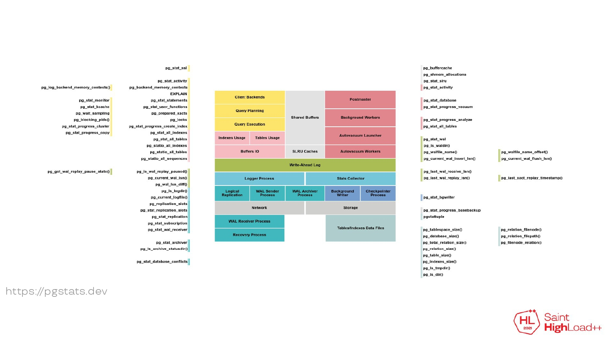

- [Первоначальная настройка](https://pgconfigurator.cybertec.at/)
- [Базовая настройка](https://pgtune.godream.su/)
- [PgBadger](https://pgbadger.darold.net/examples/sample.html) - GUI для просмотра логов
- [pgversions](https://pgversions.com/) - показывает различия в фичах и багах между версиями
- [PgPedia](https://pgpedia.info/) - справочник по фичам Postgres

### Оптимизация

- [Как поймать и обезвредить проблемные запросы в PostgreSQL](https://habr.com/ru/companies/postgrespro/articles/872574/)
- [Хранение пустых (NULL) значений в таблицах PostgreSQL](https://habr.com/ru/articles/890718/) - как хранятся тьюплы с NULL в куче

### Визуализация explain

- [explain.dalibo.com](https://explain.dalibo.com/)
- [Tensor](https://explain.tensor.ru/) - более понятная реализация

### Миграция с Oracle

- [Как мы мигрировали из Oracle в PostgreSQL](https://habr.com/ru/companies/vtb/articles/819133/) - опыт ВТБ

### Мониторинг

- [Что нового в плане мониторинга в PostgreSQL (Алексей Лесовский)](https://habr.com/ru/articles/658137/)

### Полнотекстовый поиск

- [Быстрее пули: как найти счастье с PostgreSQL](https://habr.com/ru/companies/rostelecom/articles/853124/)

### Анонимизация данных

- [Ревизор приехал: pg_anon проверяет, всё ли скрыто](https://habr.com/ru/companies/rostelecom/articles/876124/) - утилита для маскирования данных в дампе postgres

### JSONB

- [Работа с колонками типа JSON в PostgreSQL (на примере использования отдельных функций)](https://habr.com/ru/articles/883884/) - простые примеры для работы с jsonb

### TOAST

- [Техника TOAST (The Oversized-Attribute Storage Technique) в PostgreSQL](https://habr.com/ru/articles/888926/)