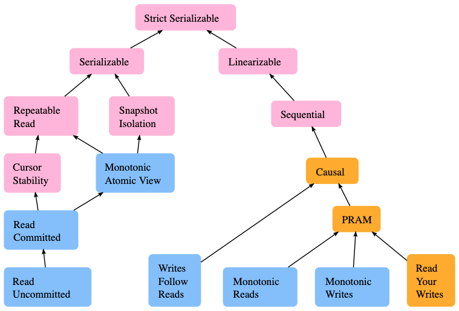

- [От Isolation к Consistency — дорога длиной в 30 лет](https://habr.com/ru/articles/705332/)
- [Hermitage: Testing transaction isolation levels](https://github.com/ept/hermitage/tree/master) - сравнение уровней изоляции от jepsen

