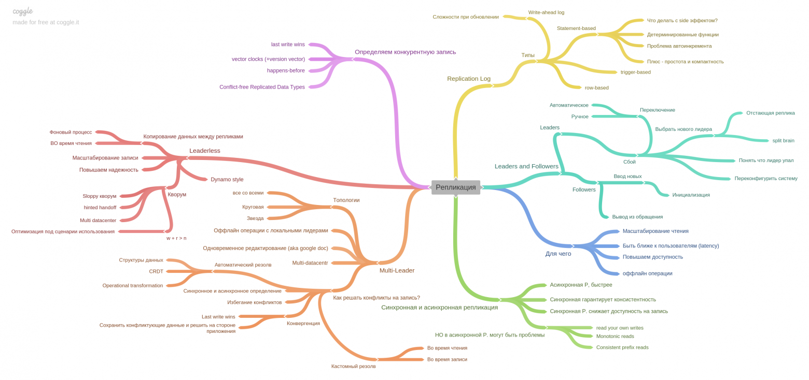
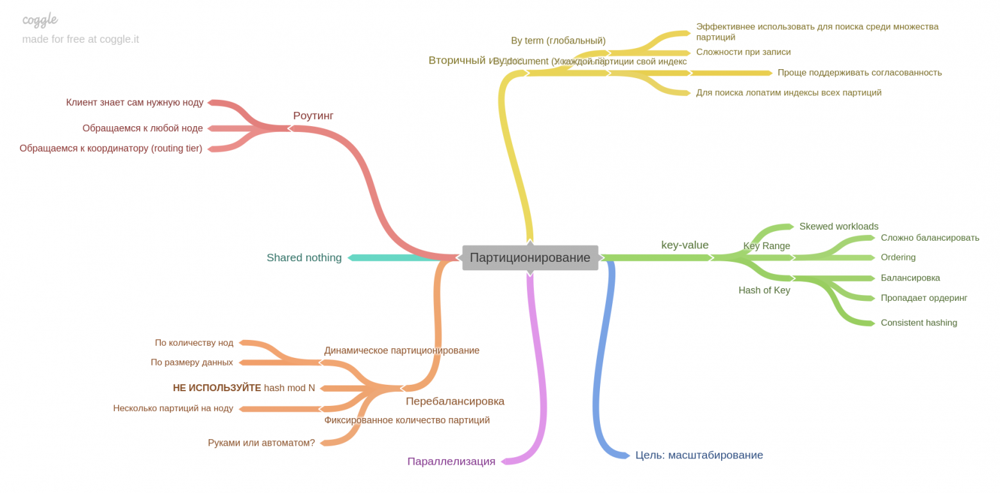
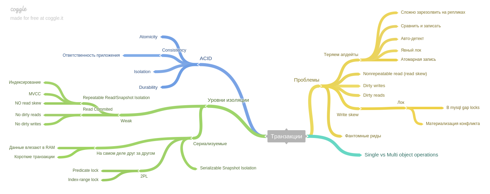
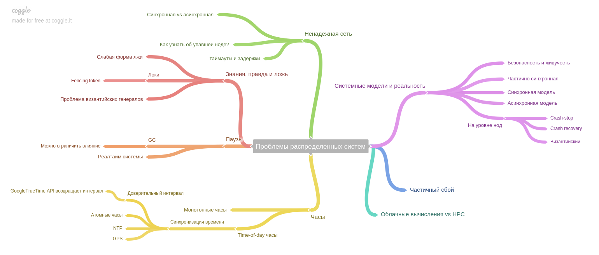
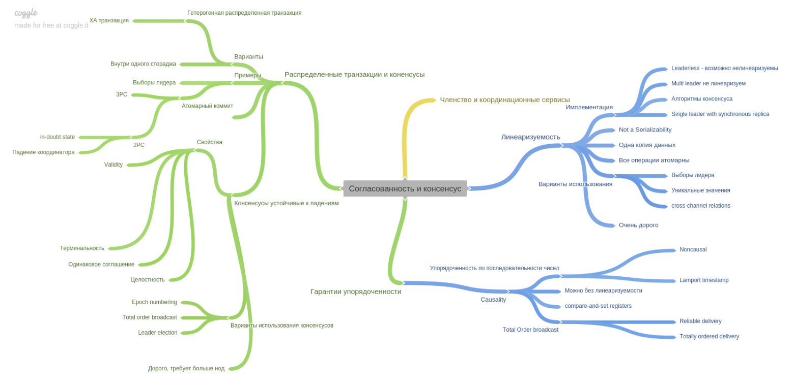
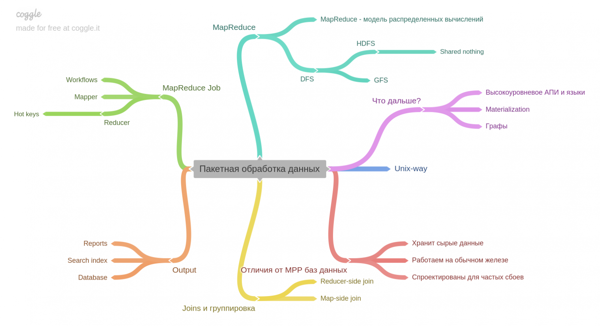
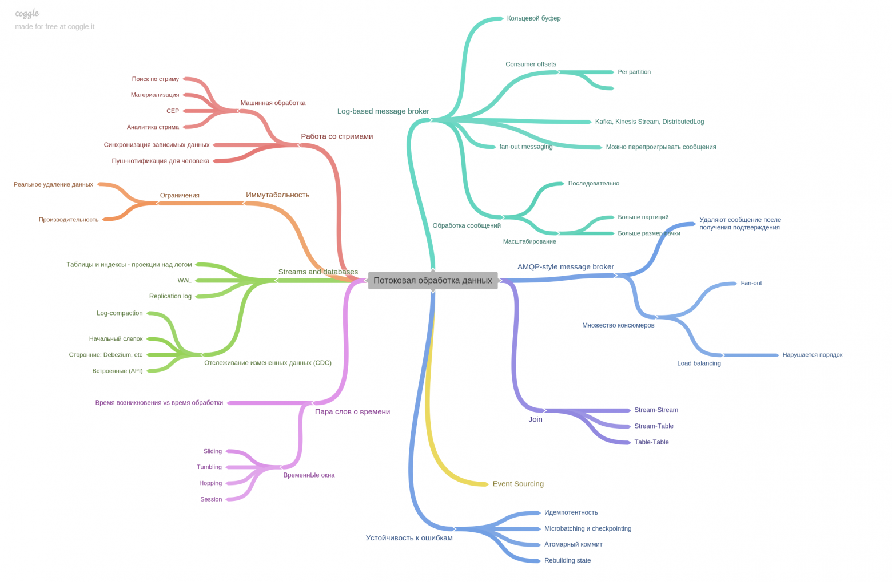
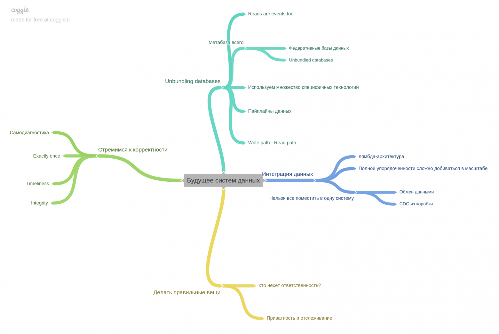

## Репликация

## Шардирование

## Транзакции

## Проблемы распределённых систем

## Согласованность и консенсус

## Пакетная обработка данных

## Потоковая обработка данных

## Будущее

---

- [DDIA book (книга с кабанчиком) — сделай level up в понимании баз данных](https://habr.com/ru/articles/423981/)